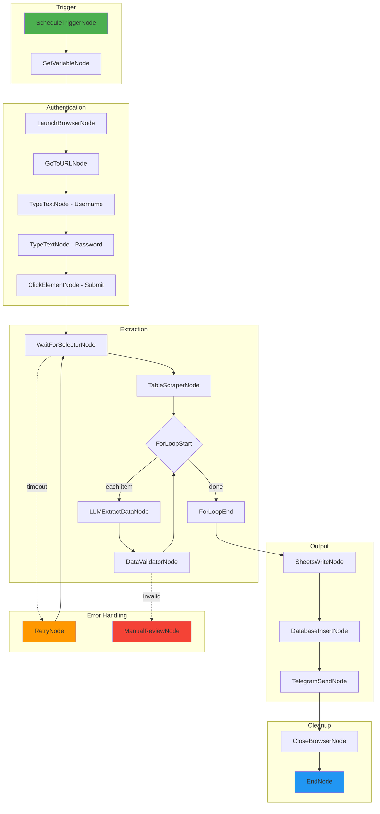

# /plan-workflow [goal]

> **AI-Powered Workflow Planning Assistant**
>
> Analyzes requirements, discovers nodes, identifies gaps, creates optimized plans, and generates ready-to-use workflows.

## What This Command Does

1. **UNDERSTAND** - Parse workflow requirements
2. **DISCOVER** - Search 413+ nodes via semantic search & registry
3. **ANALYZE** - Gap analysis with node suggestions (existing + new)
4. **PLAN** - Create modular, scalable architecture
5. **OPTIMIZE** - AI model selection, caching, token cost estimation
6. **GENERATE** - Auto-create workflow JSON + Mermaid diagram
7. **IMPLEMENT** - Create missing nodes via `/implement-node`

## Quick Start

```bash
# Interactive mode
/plan-workflow

# With goal
/plan-workflow "Login to website, scrape product prices, save to Google Sheets"

# Complex AI workflow
/plan-workflow "Monitor inbox for invoices, extract data with AI, update database, send Slack notification"
```

---

## Phase 1: UNDERSTAND (explore agent)

### Extract Requirements

| Aspect | Auto-Detect |
|--------|-------------|
| **Goal** | Primary objective |
| **Trigger** | ScheduleNode, WebhookNode, EmailTriggerNode, FileTriggerNode, etc. |
| **Input Sources** | Website, API, File, Database, Email |
| **Output Targets** | Sheets, Database, File, API, Notification |
| **Actions** | Login, Navigate, Extract, Transform, Save |
| **Error Scenarios** | Auth failure, Rate limit, Not found, Timeout |
| **Scale** | Items count, parallelization needs |

### Available Trigger Nodes

| Trigger | Node | Use When |
|---------|------|----------|
| Manual | StartNode | User initiates |
| Schedule | ScheduleTriggerNode | Cron/interval based |
| Webhook | WebhookTriggerNode | External HTTP call |
| Email | EmailTriggerNode | New email arrives |
| File | FileTriggerNode | File created/modified |
| Telegram | TelegramTriggerNode | Bot message received |
| Calendar | CalendarTriggerNode | Calendar event |

---

## Phase 2: DISCOVER (explore + semantic search)

### Node Discovery Strategy

```python
# 1. Semantic search (qdrant)
qdrant-find: "{goal} automation"
qdrant-find: "{action} {target} node"

# 2. Registry scan
Read: src/casare_rpa/nodes/_index.md
Grep: "class.*Node" --path src/casare_rpa/nodes/{category}/

# 3. Super Nodes check (consolidated actions)
Read: src/casare_rpa/nodes/file/super_node.py
# FileSystemSuperNode: 12 actions in one node
# StructuredDataSuperNode: 7 actions in one node
```

### Category Search Matrix

| Goal Keywords | Categories to Search | Priority Nodes |
|---------------|---------------------|----------------|
| "website", "scrape", "browser" | browser | LaunchBrowserNode, TableScraperNode, ExtractTextNode |
| "API", "HTTP", "REST" | rest_api | HttpRequestNode, ApiAuthNode |
| "file", "CSV", "JSON" | file_operations | FileSystemSuperNode, StructuredDataSuperNode |
| "database", "SQL" | database | DatabaseConnectNode, DatabaseQueryNode |
| "Google", "Sheets", "Gmail" | google | SheetsWriteNode, GmailSendNode, DriveUploadNode |
| "AI", "extract", "classify" | ai_ml | LLMExtractDataNode, AIConditionNode, LLMClassifyNode |
| "loop", "condition", "retry" | control_flow, error_handling | ForLoopStartNode, IfNode, TryCatchNode |
| "notify", "message", "alert" | messaging | TelegramSendNode, SlackNotifyNode |
| "Windows", "desktop", "click" | desktop_automation | FindElementNode, ClickElementNode, OCRNode |

---

## Phase 3: ANALYZE (architect agent)

### Gap Analysis Framework

```
For each required capability:

A. EXACT MATCH → Use existing node directly
   Example: "Click button" → ClickElementNode

B. PARTIAL MATCH → Configure existing node + document
   Example: "Click after hover" → ClickElementNode with wait_after_hover property

C. COMBINATION → Chain multiple nodes
   Example: "Extract nested data" → ExtractTextNode → JSONParseNode → ForLoopNode

D. MISSING → Three options:
   D1. Workaround with existing nodes
   D2. Propose new node specification
   D3. Invoke /implement-node to create it
```

### Output: Gap Analysis Report

```markdown
## Gap Analysis: "{goal}"

### Available Nodes (Direct Use)
| Need | Node | Confidence |
|------|------|------------|
| Open browser | LaunchBrowserNode | 100% |
| Navigate | GoToURLNode | 100% |
| Extract table | TableScraperNode | 95% |

### Configuration Required
| Need | Node | Config Needed |
|------|------|---------------|
| Login form | TypeTextNode | selector, clear_first=true |
| Wait for load | WaitForSelectorNode | timeout=30000 |

### Workarounds (Node Combinations)
| Need | Solution | Nodes Used |
|------|----------|------------|
| Paginated scraping | Loop + Navigate + Scrape | ForLoopStartNode → GoToURLNode → TableScraperNode |
| Conditional extraction | Check + Branch | IfNode → ExtractTextNode (true) / SkipNode (false) |

### Missing Capabilities
| Need | Proposed Solution | Priority |
|------|-------------------|----------|
| Auto-pagination | New: PaginatedScraperNode | High |
| Data deduplication | New: DeduplicateNode | Medium |

### New Node Proposals (will invoke /implement-node)
1. **PaginatedScraperNode**
   - Category: browser
   - Purpose: Handle infinite scroll / pagination automatically
   - Inputs: url, selector, max_pages
   - Outputs: all_data (LIST)

Shall I create these missing nodes? (y/n)
```

---

## Phase 4: PLAN (architect agent)

### Workflow Architecture

```markdown
# Workflow: {Name}

## Metadata
- **Purpose**: {description}
- **Trigger**: {TriggerNodeType}
- **Estimated Nodes**: {count}
- **AI Nodes**: {ai_node_count}
- **Estimated Token Cost**: {cost_estimate}

## Client Configuration Variables
All values below can be customized per client:

| Variable | Type | Default | Description |
|----------|------|---------|-------------|
| `{{target_url}}` | STRING | - | Target website URL |
| `{{login_username}}` | CREDENTIAL | - | Login username (from vault) |
| `{{login_password}}` | CREDENTIAL | - | Login password (from vault) |
| `{{data_selector}}` | SELECTOR | - | CSS selector for data extraction |
| `{{output_sheet_id}}` | STRING | - | Google Sheet ID for output |
| `{{output_database}}` | STRING | - | Database connection string |
| `{{notification_channel}}` | STRING | - | Slack/Telegram channel |
| `{{max_retries}}` | INTEGER | 3 | Retry attempts on failure |
| `{{error_threshold}}` | INTEGER | 5 | Abort after N errors |
| `{{batch_size}}` | INTEGER | 100 | Items per batch |
| `{{parallel_workers}}` | INTEGER | 1 | Concurrent browser instances |

## Workflow Steps

### Phase 1: Initialization
1. **{TriggerNode}** → Start workflow
2. **SetVariableNode** → Load client configuration
3. **CredentialResolveNode** → Get credentials from vault

### Phase 2: Data Acquisition
4. **LaunchBrowserNode** → headless={{headless_mode}}
5. **GoToURLNode** → url={{target_url}}
6. **TypeTextNode** → Login username
7. **TypeTextNode** → Login password
8. **ClickElementNode** → Submit login
9. **WaitForSelectorNode** → Wait for dashboard

### Phase 3: Extraction
10. **TableScraperNode** → Extract main data
11. **ForLoopStartNode** → Iterate items
12. **LLMExtractDataNode** → AI-enhance extraction
13. **ForLoopEndNode** → Complete iteration

### Phase 4: Output
14. **SheetsWriteNode** → Save to {{output_sheet_id}}
15. **DatabaseInsertNode** → Save to {{output_database}}
16. **TelegramSendNode** → Notify {{notification_channel}}

### Phase 5: Cleanup
17. **CloseBrowserNode** → Close browser
18. **EndNode** → Complete

## Error Handling Matrix
| Error | Detection | Handler | Action |
|-------|-----------|---------|--------|
| Auth failure | IfNode (login_success==false) | TryCatchNode | Re-auth or escalate |
| Element not found | WaitForSelectorNode timeout | RetryNode | Retry {{max_retries}}x |
| Rate limited | HttpStatus == 429 | WaitNode | Wait 60s, retry |
| Data validation | DataValidatorNode | IfNode | Route to manual review |
| Threshold exceeded | error_count > {{error_threshold}} | BreakNode | Abort with notification |

## Modular Components (Reusable Subflows)
| Subflow | Purpose | Can Replace |
|---------|---------|-------------|
| `auth_flow` | Login sequence | Any auth method |
| `extraction_flow` | Data extraction | Different selectors |
| `output_flow` | Save results | Different destinations |
| `notification_flow` | Send alerts | Different channels |
```

---

## Phase 5: OPTIMIZE (AI & Performance)

### AI Model Selection

```markdown
## AI Optimization Strategy

### Model Recommendations
| Task | Recommended Model | Why | Est. Cost/1K items |
|------|-------------------|-----|-------------------|
| Data extraction | gpt-4o-mini | Fast, cheap, good at structured | $0.15 |
| Classification | claude-3-haiku | Very fast, accurate categories | $0.10 |
| Complex reasoning | gpt-4o | Best accuracy for ambiguous data | $2.50 |
| Code generation | claude-3.5-sonnet | Best for code tasks | $1.50 |
| Summarization | gemini-1.5-flash | Good balance, long context | $0.08 |

### Token Optimization Strategies
1. **Prompt Caching**
   - Cache system prompts (reduces cost 50-90%)
   - Use `PromptTemplateNode` with cached templates

2. **Batch Processing**
   - Group items before LLM calls
   - Use `LLMBatchNode` for bulk processing

3. **Tiered Processing**
   - Fast model first (haiku/flash)
   - Escalate to powerful model only if needed

4. **Context Window Management**
   - Chunk large documents
   - Use RAGNode for selective retrieval

### Estimated Costs
| Component | Items | Model | Tokens/Item | Cost |
|-----------|-------|-------|-------------|------|
| Extraction | 1000 | gpt-4o-mini | ~500 | $0.15 |
| Classification | 1000 | claude-3-haiku | ~200 | $0.05 |
| Summarization | 100 | gemini-flash | ~1000 | $0.02 |
| **Total** | - | - | - | **$0.22** |

### Performance Optimizations
| Optimization | Implementation | Impact |
|--------------|----------------|--------|
| Parallel browsers | Set {{parallel_workers}} > 1 | 2-5x faster |
| Batch writes | Accumulate 100 rows before write | Reduce API calls |
| Smart waits | WaitForSelectorNode vs fixed delay | 30-50% faster |
| Connection pooling | Reuse database connections | Reduce overhead |
| Lazy loading | Load nodes on demand | Faster startup |
```

---

## Phase 6: GENERATE

### Auto-Generate Workflow JSON

The command automatically generates a complete workflow JSON:

```json
{
  "metadata": {
    "name": "{{workflow_name}}",
    "description": "{{description}}",
    "version": "1.0.0",
    "author": "AI Workflow Planner",
    "created_at": "{{timestamp}}"
  },
  "variables": {
    "target_url": {"type": "STRING", "default": "", "description": "Target URL"},
    "output_sheet_id": {"type": "STRING", "default": "", "description": "Output Sheet"},
    "max_retries": {"type": "INTEGER", "default": 3, "description": "Retry attempts"}
  },
  "settings": {
    "stop_on_error": false,
    "timeout": 300,
    "retry_count": 3,
    "parallel_execution": true
  },
  "nodes": {
    "start_1": {
      "node_id": "start_1",
      "node_type": "StartNode",
      "config": {},
      "position": [0, 0]
    },
    "launch_browser_2": {
      "node_id": "launch_browser_2",
      "node_type": "LaunchBrowserNode",
      "config": {"headless": true},
      "position": [200, 0]
    }
    // ... all nodes
  },
  "connections": [
    {"source_node": "start_1", "source_port": "exec_out", "target_node": "launch_browser_2", "target_port": "exec_in"},
    // ... all connections
  ]
}
```

### Auto-Generate Mermaid Diagram



---

## Phase 7: IMPLEMENT (Missing Nodes)

### Automatic Node Creation

When gaps are identified, the command can invoke `/implement-node`:

```python
# For each missing node in gap analysis:
if user_approved:
    Task(subagent_type="builder", prompt="""
    /implement-node {category}

    Create: {NodeName}
    Purpose: {purpose}

    Inputs:
    {input_ports}

    Outputs:
    {output_ports}

    Properties:
    {properties}

    Follow patterns from: {similar_node}
    """)
```

### Node Implementation Flow

```
Gap Identified → Propose Node Spec → User Approval → /implement-node
                                                          ↓
                                            ┌─────────────────────────┐
                                            │ builder: Create node    │
                                            │ ui: Create visual node  │
                                            │ quality: Create tests   │
                                            └─────────────────────────┘
                                                          ↓
                                            Continue workflow planning
```

---

## Complete Agent Flow

```
┌───────────┐   ┌───────────┐   ┌───────────┐   ┌───────────┐   ┌───────────┐   ┌───────────┐   ┌───────────┐
│ UNDERSTAND│ → │  DISCOVER │ → │  ANALYZE  │ → │   PLAN    │ → │ OPTIMIZE  │ → │ GENERATE  │ → │ IMPLEMENT │
│  explore  │   │  explore  │   │ architect │   │ architect │   │ architect │   │  builder  │   │  builder  │
│           │   │ + qdrant  │   │           │   │           │   │           │   │           │   │ + ui +    │
│           │   │           │   │           │   │           │   │           │   │           │   │ quality   │
└───────────┘   └───────────┘   └───────────┘   └───────────┘   └───────────┘   └───────────┘   └───────────┘
                                      │                                               │               │
                                      ↓                                               ↓               ↓
                               Gap Analysis                                    Workflow JSON    New Nodes
                               Report                                          + Mermaid        Created
```

---

## Output Summary

After running `/plan-workflow`, you receive:

| Output | Format | Purpose |
|--------|--------|---------|
| Gap Analysis | Markdown table | What's available vs missing |
| Workflow Plan | Markdown structure | Step-by-step architecture |
| Variables Template | JSON/Table | All client-configurable values |
| AI Optimization | Markdown | Model selection, costs, caching |
| Mermaid Diagram | Mermaid code | Visual workflow representation |
| Workflow JSON | JSON | Ready for AI Assistant or direct use |
| New Node Specs | Markdown | Specs for missing nodes (if any) |

---

## Example: Full Output

```bash
/plan-workflow "Scrape e-commerce product data, enrich with AI descriptions, save to database and notify"
```

**Result:**

```markdown
# Workflow Plan: E-Commerce Product Scraper with AI Enrichment

## Quick Stats
- Nodes: 18
- AI Nodes: 2 (LLMExtractDataNode, LLMSummarizeNode)
- Estimated Cost: $0.35/1000 products
- Missing Nodes: 1 (PaginatedScraperNode - will create)

## Gap Analysis
[... detailed table ...]

## Workflow Steps
[... numbered steps ...]

## Variables (All Customizable)
[... complete variable table ...]

## AI Optimization
- Extraction: gpt-4o-mini ($0.15/1K)
- Descriptions: claude-3-haiku ($0.20/1K)
- Caching: System prompts cached (50% savings)

## Mermaid Diagram
[... diagram code ...]

## Generated JSON
[... complete workflow JSON ...]

## Missing Nodes to Create
1. PaginatedScraperNode - Creating now via /implement-node...
```

---

## Related Commands

| Command | When to Use |
|---------|-------------|
| `/implement-node` | Create nodes identified in gap analysis |
| `/implement-feature` | Add features to existing nodes |
| `/fix-feature` | Fix issues in generated workflows |

## Key Files

| File | Purpose |
|------|---------|
| `nodes/_index.md` | Node reference (413+ nodes) |
| `infrastructure/ai/_index.md` | SmartWorkflowAgent docs |
| `domain/ai/_index.md` | AI prompts & configuration |
| `infrastructure/ai/registry_dumper.py` | Node manifest for LLM |
