# CasareRPA Component Diagram

This document provides detailed component diagrams showing the internal structure and interactions within each major application of the CasareRPA platform.

## Table of Contents

1. [Canvas (Designer) Components](#canvas-designer-components)
2. [Robot (Executor) Components](#robot-executor-components)
3. [Orchestrator (Manager) Components](#orchestrator-manager-components)
4. [Shared Infrastructure Components](#shared-infrastructure-components)
5. [Component Dependencies](#component-dependencies)

---

## Canvas (Designer) Components

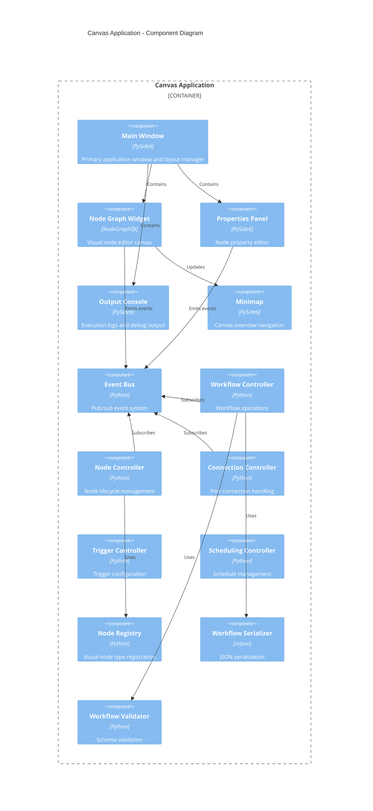

### Canvas Component Details

| Component | Responsibility | Key Classes |
|-----------|---------------|-------------|
| Main Window | Application shell, menu bar, toolbar | `MainWindow` |
| Node Graph Widget | Visual editing canvas | `NodeGraphWidget`, `CustomNodeItem` |
| Properties Panel | Node configuration UI | `PropertiesPanel`, `PropertyWidgets` |
| Output Console | Log display | `OutputConsoleWidget` |
| Event Bus | Decoupled communication | `EventBus`, `EventBatcher` |
| Workflow Controller | Save/load/execute workflows | `WorkflowController` |
| Node Controller | Create/delete/configure nodes | `NodeController` |
| Connection Controller | Validate and manage connections | `ConnectionController` |
| Node Registry | Node type catalog | `NodeRegistry` |

### Controller Interactions

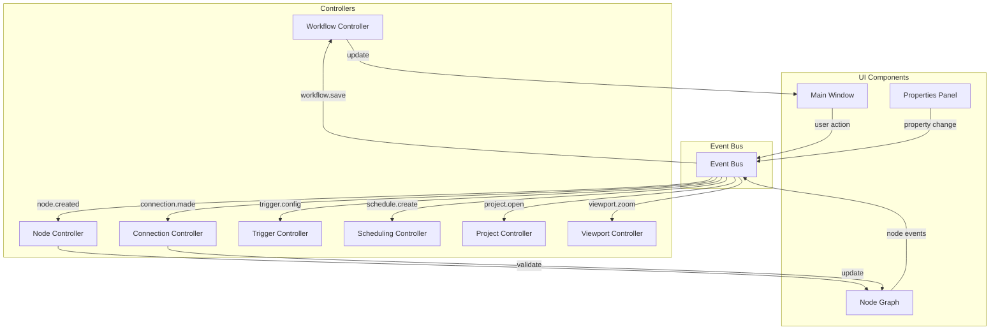

---

## Robot (Executor) Components

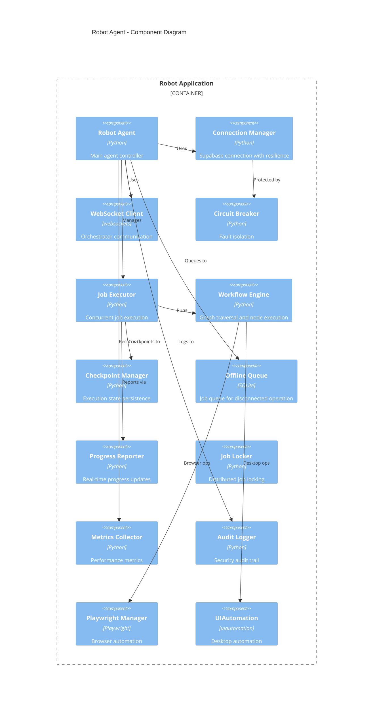

### Robot Component Details

| Component | Responsibility | Key Classes |
|-----------|---------------|-------------|
| Robot Agent | Main lifecycle controller | `RobotAgent` |
| Connection Manager | Supabase connection with backoff | `ConnectionManager`, `ConnectionConfig` |
| WebSocket Client | Bidirectional Orchestrator communication | `RobotWebSocketClient` |
| Circuit Breaker | Prevent cascade failures | `CircuitBreaker`, `CircuitBreakerConfig` |
| Job Executor | Concurrent job execution | `JobExecutor` |
| Workflow Engine | Node-by-node execution | `WorkflowEngine` |
| Checkpoint Manager | Crash recovery | `CheckpointManager` |
| Offline Queue | Disconnected operation | `OfflineQueue` |
| Progress Reporter | Real-time updates | `ProgressReporter` |
| Playwright Manager | Browser automation | `PlaywrightManager` |

### Execution Flow

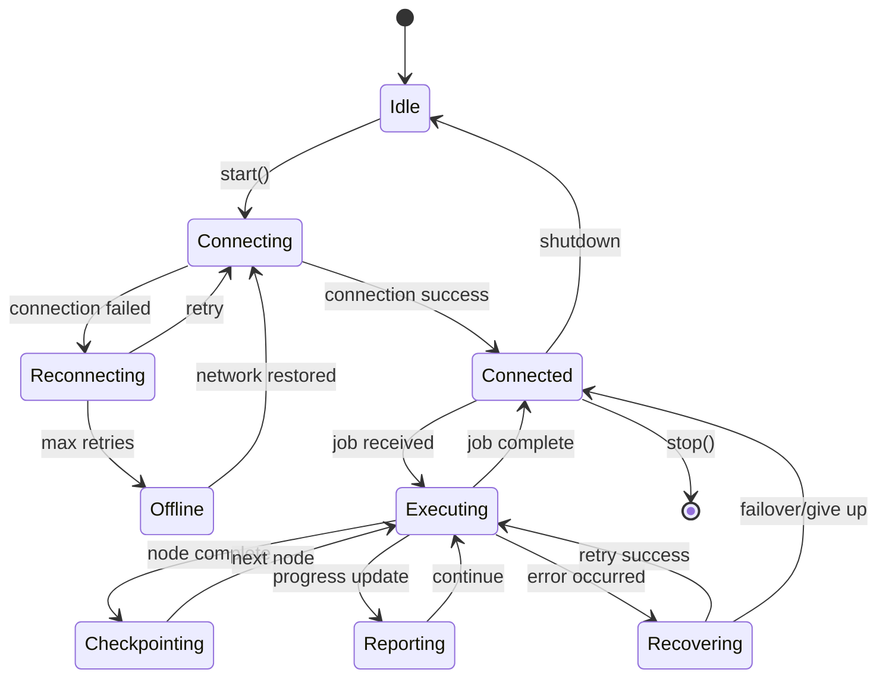

---

## Orchestrator (Manager) Components

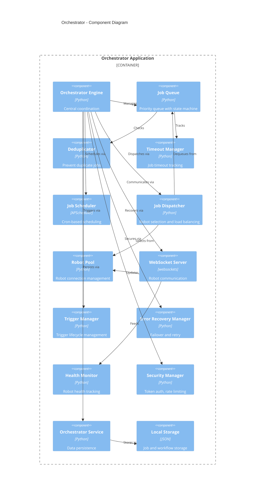

### Orchestrator Component Details

| Component | Responsibility | Key Classes |
|-----------|---------------|-------------|
| Orchestrator Engine | Central coordination | `OrchestratorEngine` |
| Job Queue | Priority-based job management | `JobQueue`, `JobStateMachine` |
| Job Scheduler | Time-based execution | `JobScheduler` |
| Job Dispatcher | Robot selection | `JobDispatcher`, `LoadBalancingStrategy` |
| WebSocket Server | Robot communication | `OrchestratorServer`, `RobotConnection` |
| Trigger Manager | Trigger lifecycle | `TriggerManager` |
| Error Recovery Manager | Failover handling | `ErrorRecoveryManager`, `RetryPolicy` |
| Health Monitor | Robot health | `HealthMonitor`, `HealthMetrics` |
| Security Manager | Authentication | `SecurityManager`, `AuthToken` |

### Load Balancing Strategies

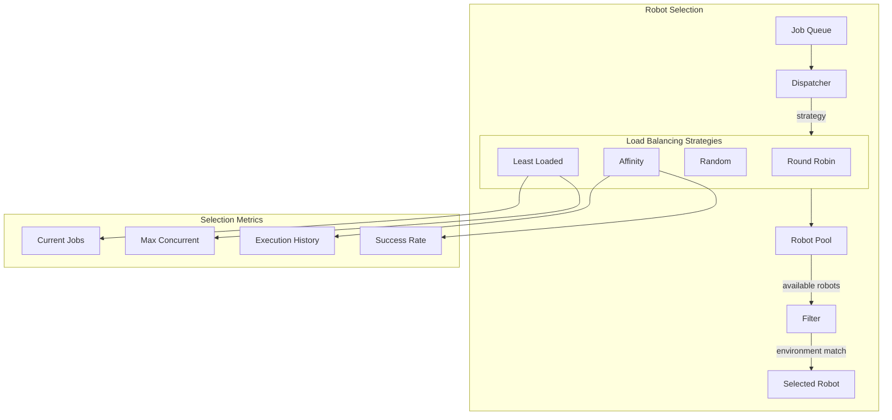

---

## Shared Infrastructure Components

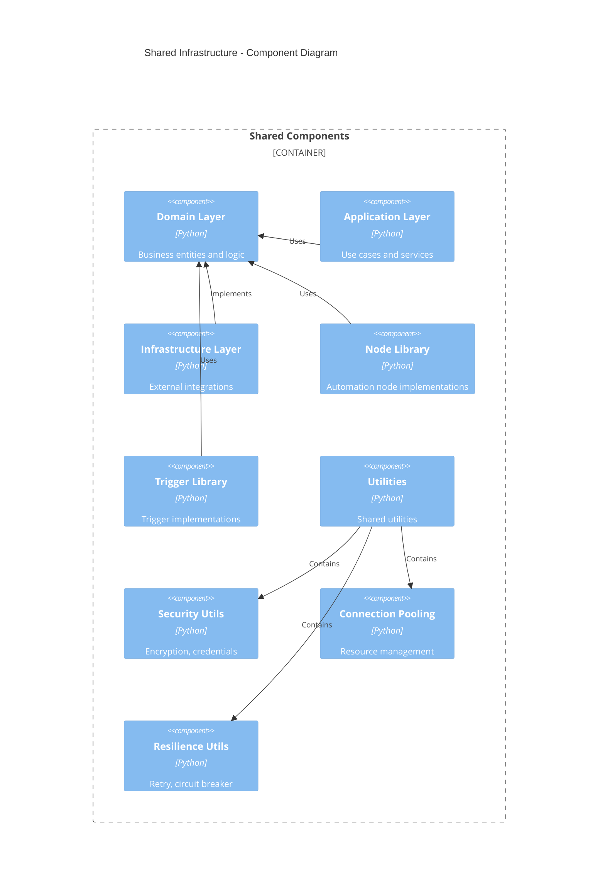

### Node Architecture

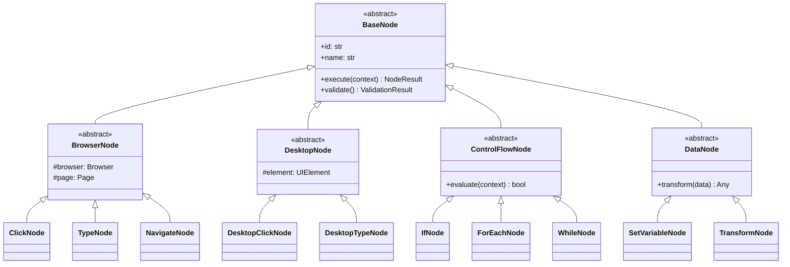

---

## Component Dependencies

### Dependency Matrix

| Component | Canvas | Robot | Orchestrator | Domain | Infrastructure |
|-----------|--------|-------|--------------|--------|----------------|
| Canvas | - | No | WebSocket | Yes | Yes |
| Robot | No | - | WebSocket | Yes | Yes |
| Orchestrator | WebSocket | WebSocket | - | Yes | Yes |
| Domain | No | No | No | - | No |
| Infrastructure | No | No | No | Yes | - |

### External Dependencies

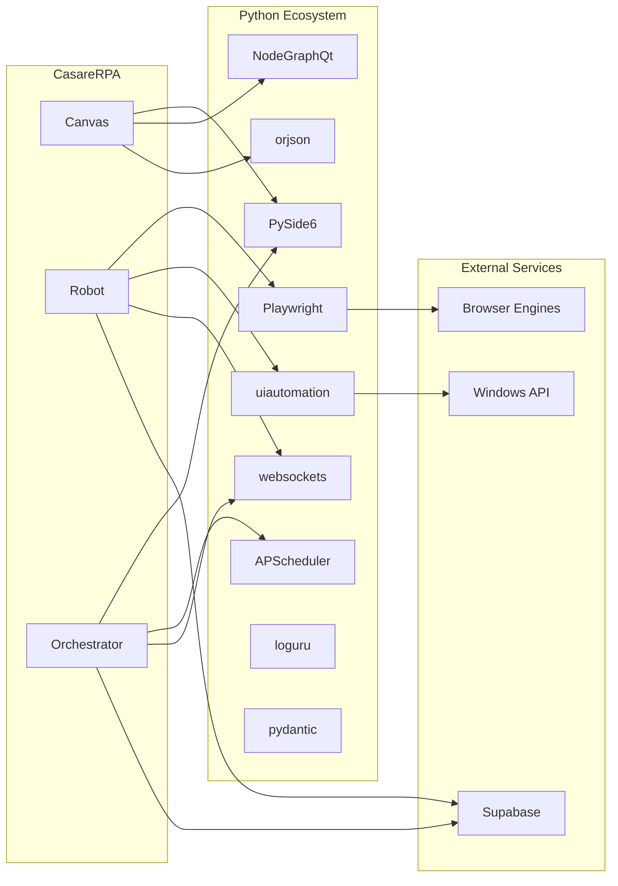

### Package Structure

```
src/casare_rpa/
    domain/
        entities/          # Business entities
        value_objects/     # Immutable value types
        services/          # Domain services
        repositories/      # Repository interfaces

    application/
        use_cases/         # Application use cases
        services/          # Application services
        execution/         # Workflow execution
        scheduling/        # Schedule management
        workflow/          # Workflow operations

    infrastructure/
        persistence/       # Storage implementations
        events/            # Event infrastructure

    presentation/
        canvas/            # Designer application
            controllers/   # Controller classes
            graph/         # Node graph components
            visual_nodes/  # Visual node wrappers
            ui/            # UI widgets and dialogs

    orchestrator/          # Orchestrator application
        panels/            # UI panels
        views/             # Dashboard views

    robot/                 # Robot application

    nodes/                 # Node implementations
        browser/           # Browser automation nodes
        desktop/           # Desktop automation nodes
        control_flow/      # Control flow nodes
        data/              # Data operation nodes

    triggers/              # Trigger implementations
        implementations/   # Concrete triggers

    utils/                 # Shared utilities
        security/          # Security utilities
        pooling/           # Connection pooling
        resilience/        # Resilience patterns
```

---

## Deployment Topologies

### Single-Node Deployment

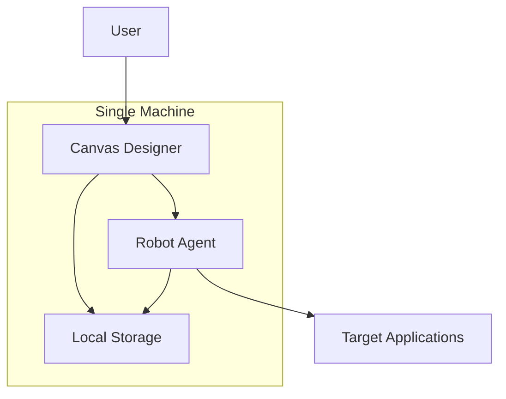

### Multi-Robot Deployment

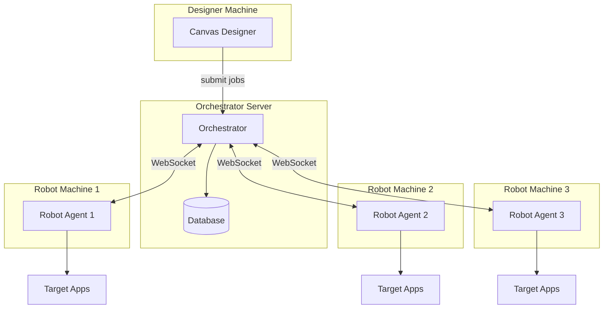

### Cloud-Hybrid Deployment

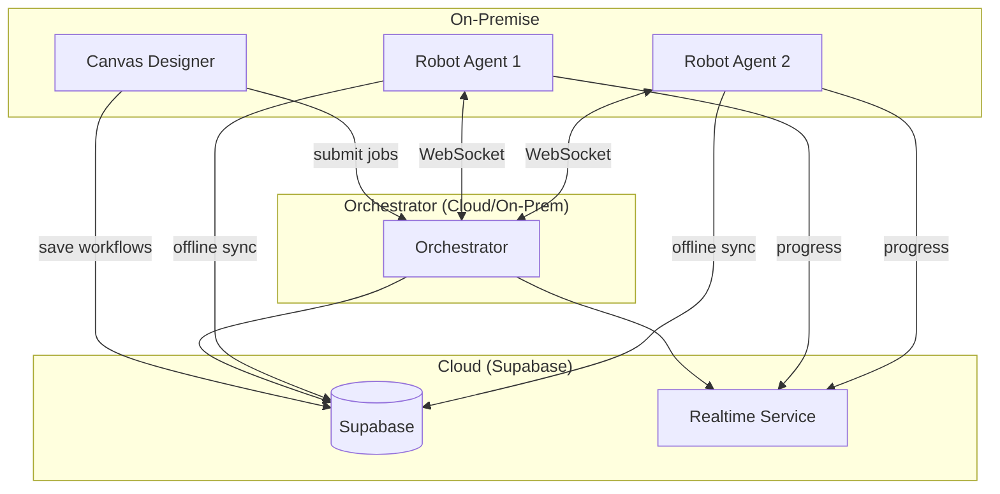

---

## Related Documentation

- [System Overview](SYSTEM_OVERVIEW.md)
- [Data Flow Diagrams](DATA_FLOW.md)
- [API Reference](../api/REST_API_REFERENCE.md)
- [Security Architecture](../security/SECURITY_ARCHITECTURE.md)
