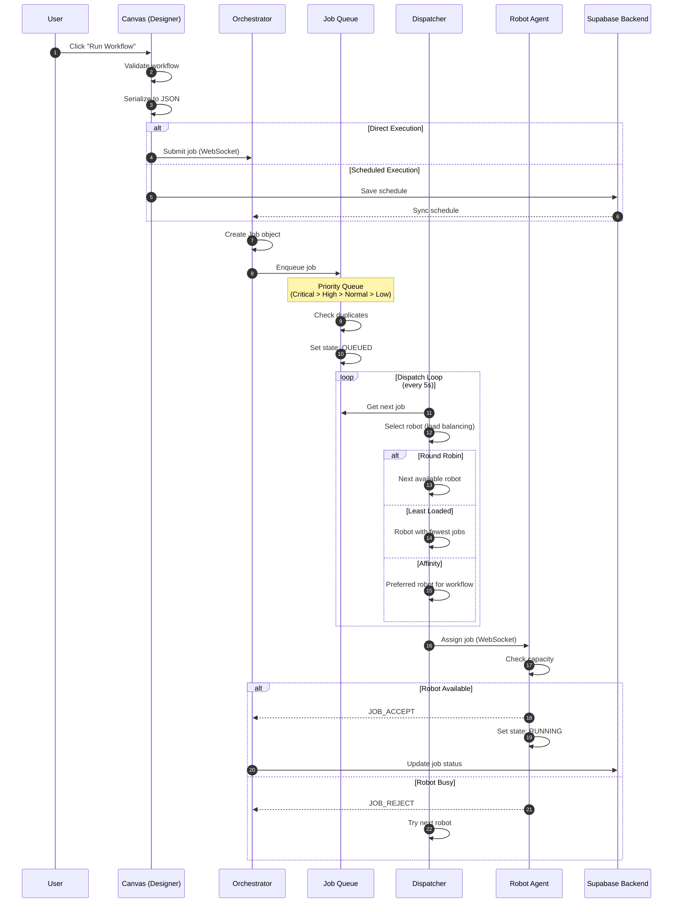
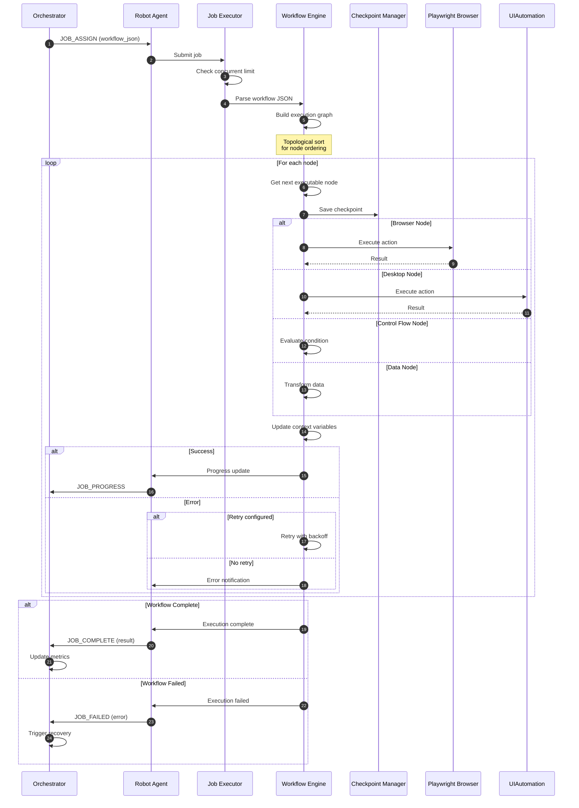
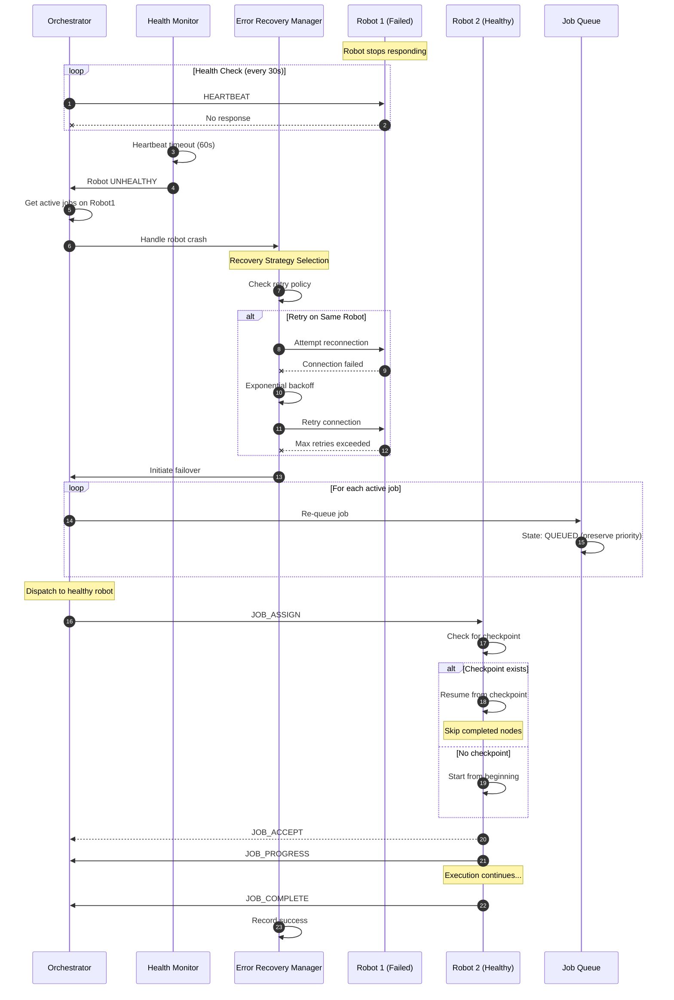
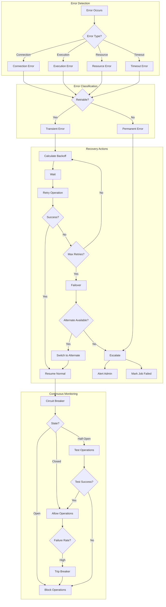
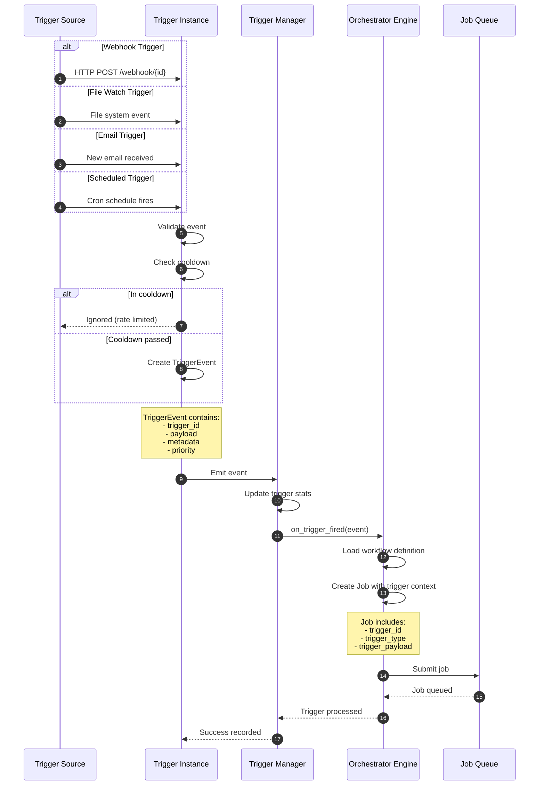
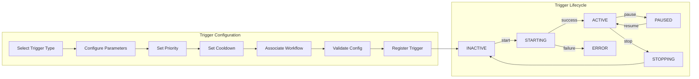
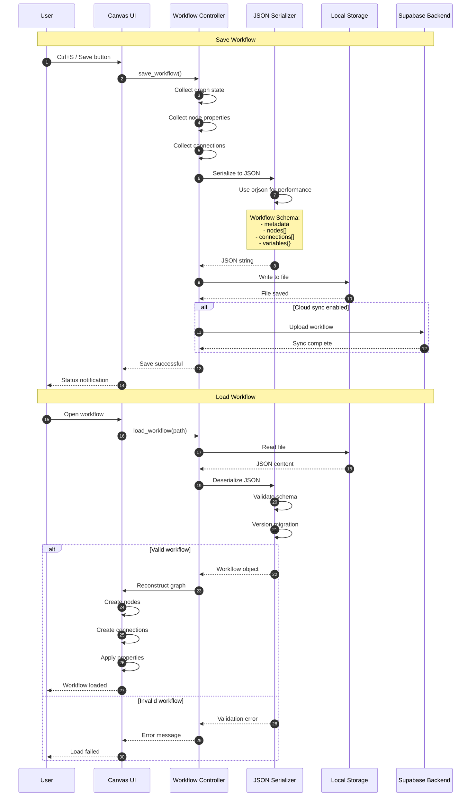
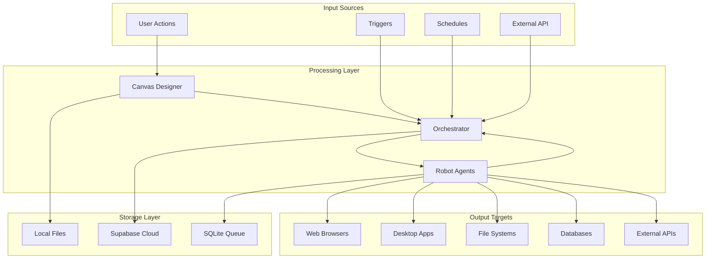

# CasareRPA Data Flow Diagrams

This document describes the key data flows within the CasareRPA platform using sequence diagrams and flow charts.

## Table of Contents

1. [Job Submission Flow](#job-submission-flow)
2. [Robot Execution Flow](#robot-execution-flow)
3. [Failover and Recovery Flow](#failover-and-recovery-flow)
4. [Self-Healing Flow](#self-healing-flow)
5. [Trigger Event Flow](#trigger-event-flow)
6. [Workflow Persistence Flow](#workflow-persistence-flow)

---

## Job Submission Flow

This diagram shows the complete flow from job submission to execution start.



---

## Robot Execution Flow

This diagram shows workflow execution within the Robot agent.



---

## Failover and Recovery Flow

This diagram shows how the system handles robot failures and job recovery.



---

## Self-Healing Flow

This diagram shows the automatic self-healing capabilities of the system.



### Recovery Strategy Details

| Error Type | Strategy | Max Retries | Backoff | Failover |
|------------|----------|-------------|---------|----------|
| ConnectionError | Retry + Failover | 3 | Exponential | Yes |
| TimeoutError | Retry | 3 | Exponential | Yes |
| NetworkError | Retry + Failover | 3 | Exponential | Yes |
| TemporaryError | Retry | 3 | Exponential | No |
| ResourceBusy | Retry | 3 | Linear | No |
| AuthenticationError | Escalate | 0 | N/A | No |
| ValidationError | Escalate | 0 | N/A | No |

---

## Trigger Event Flow

This diagram shows how triggers initiate workflow executions.



### Trigger Configuration Flow



---

## Workflow Persistence Flow

This diagram shows how workflows are saved and loaded.



### Workflow JSON Schema

```json
{
  "version": "3.0",
  "metadata": {
    "id": "uuid",
    "name": "Workflow Name",
    "description": "Description",
    "created_at": "ISO-8601",
    "updated_at": "ISO-8601",
    "author": "user@example.com"
  },
  "nodes": [
    {
      "id": "node-uuid",
      "type": "browser.click",
      "name": "Click Login",
      "position": {"x": 100, "y": 200},
      "properties": {
        "selector": "#login-button",
        "timeout": 30000
      }
    }
  ],
  "connections": [
    {
      "source_node": "node-1-uuid",
      "source_port": "output",
      "target_node": "node-2-uuid",
      "target_port": "input"
    }
  ],
  "variables": {
    "url": {"type": "string", "value": "https://example.com"},
    "credentials": {"type": "credential", "ref": "cred-uuid"}
  },
  "triggers": [
    {
      "id": "trigger-uuid",
      "type": "scheduled",
      "config": {"cron": "0 9 * * MON-FRI"}
    }
  ]
}
```

---

## Data Flow Summary



## Related Documentation

- [System Overview](SYSTEM_OVERVIEW.md)
- [Component Diagram](COMPONENT_DIAGRAM.md)
- [API Reference](../api/REST_API_REFERENCE.md)
- [Troubleshooting Guide](../operations/TROUBLESHOOTING.md)
