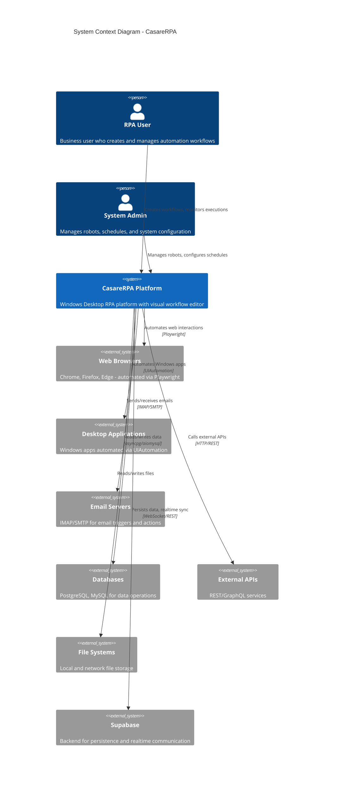
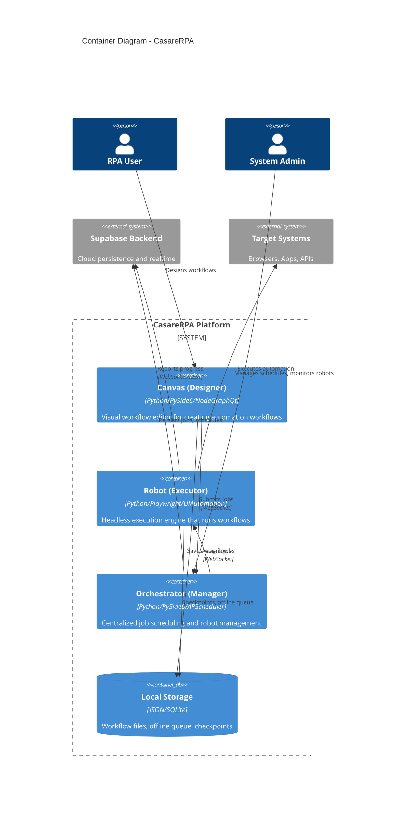
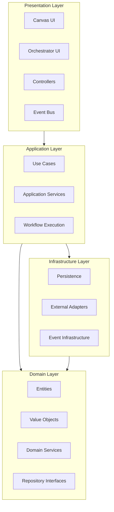
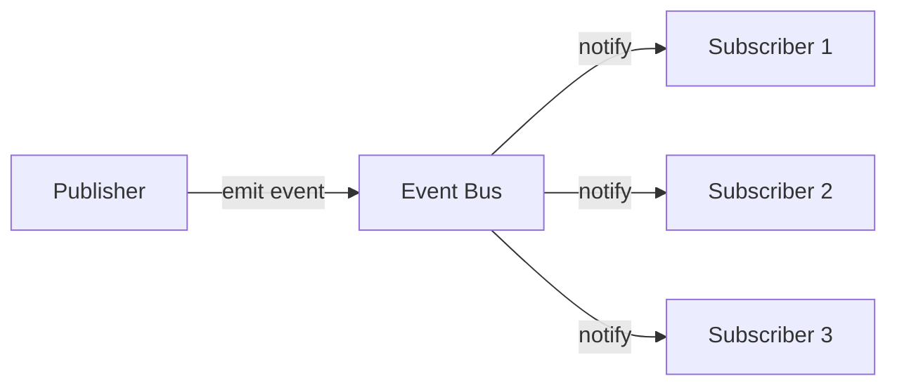
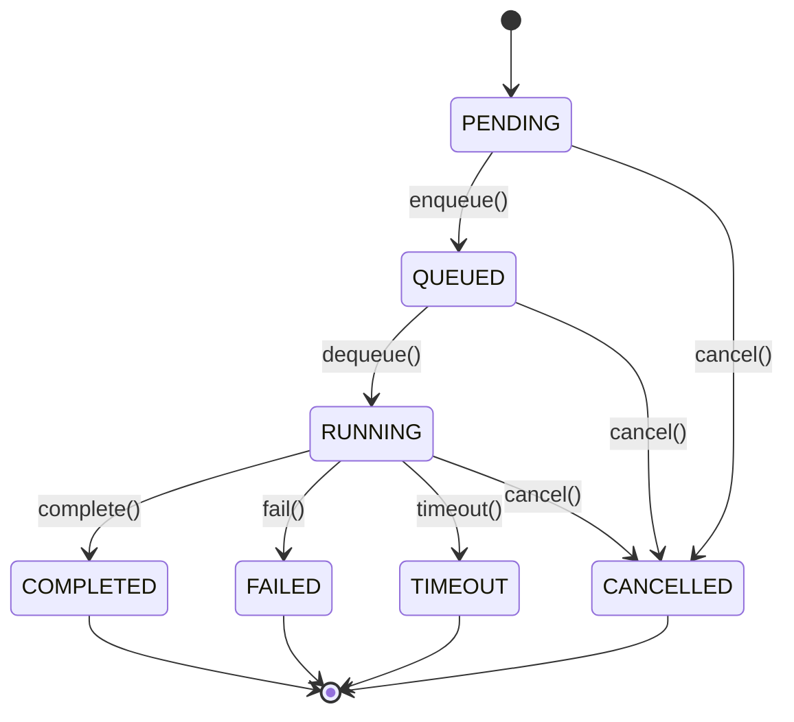
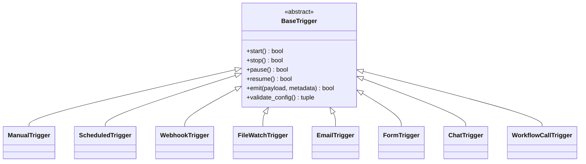

# CasareRPA System Architecture Overview

## Executive Summary

CasareRPA is a Windows Desktop RPA (Robotic Process Automation) platform that enables users to create, schedule, and execute automated workflows through a visual node-based editor. The system follows Clean Architecture (DDD) principles with three decoupled applications: Canvas (Designer), Robot (Executor), and Orchestrator (Manager).

## C4 Model Architecture

### Level 1: System Context Diagram



### Level 2: Container Diagram



## Core Applications

### 1. Canvas (Designer)

The Canvas is the visual workflow editor application where users create and edit automation workflows.

**Key Responsibilities:**
- Visual node-based workflow editing via NodeGraphQt
- Real-time workflow validation
- Node property configuration
- Workflow save/load using orjson
- Debug mode with step execution
- Desktop element selector tool

**Technology Stack:**
- PySide6 for Qt-based GUI
- NodeGraphQt for node graph visualization
- qasync for Qt + asyncio integration
- orjson for high-performance JSON serialization

**Architecture Pattern:**
- Controller pattern with specialized controllers (WorkflowController, NodeController, etc.)
- EventBus for pub/sub decoupling
- Clean separation between visual nodes and logic nodes

### 2. Robot (Executor)

The Robot is a lightweight, headless execution engine that runs workflows assigned by the Orchestrator.

**Key Responsibilities:**
- Workflow execution with graph traversal
- Browser automation via Playwright
- Desktop automation via UIAutomation
- Progress reporting to Orchestrator
- Checkpoint-based crash recovery
- Offline operation with job queue

**Technology Stack:**
- Playwright for web automation
- uiautomation for Windows desktop automation
- Supabase client for persistence
- WebSocket for Orchestrator communication

**Resilience Features:**
- Exponential backoff reconnection
- Circuit breaker for failing operations
- Per-node checkpointing
- Offline job queue

### 3. Orchestrator (Manager)

The Orchestrator is the central management application for scheduling, distributing, and monitoring workflows.

**Key Responsibilities:**
- Job queue management with priority scheduling
- Robot registration and health monitoring
- Cron-based workflow scheduling
- Trigger system management
- Real-time dashboard metrics
- Error recovery and failover

**Technology Stack:**
- APScheduler for job scheduling
- WebSocket server for robot communication
- PySide6 for management UI

## Clean Architecture Layers



### Layer Descriptions

| Layer | Purpose | Dependencies |
|-------|---------|--------------|
| **Domain** | Pure business logic, entities, value objects, domain services | None (core) |
| **Application** | Use cases, orchestrates domain + infrastructure | Domain |
| **Infrastructure** | Implementation of domain interfaces, external resources | Domain |
| **Presentation** | UI components, controllers, event handling | Application |

## Key Design Patterns

### 1. Node Pattern

All automation capabilities are implemented as nodes with a consistent interface:

```
BaseNode (Abstract)
    |
    +-- Logic Node (in nodes/)
    |       |
    |       +-- BrowserClickNode
    |       +-- IfConditionNode
    |       +-- etc.
    |
    +-- Visual Node (in visual_nodes/)
            |
            +-- BrowserClickVisualNode
            +-- IfConditionVisualNode
            +-- etc.
```

### 2. Controller Pattern

The Canvas application uses specialized controllers for different concerns:

- `WorkflowController` - Workflow operations (save, load, execute)
- `NodeController` - Node creation, deletion, configuration
- `ConnectionController` - Port connections and validation
- `TriggerController` - Trigger configuration
- `SchedulingController` - Schedule management

### 3. Event-Driven Architecture

Components communicate via an EventBus for loose coupling:



### 4. State Machine Pattern

Job and trigger states are managed by explicit state machines:



## Communication Protocols

### WebSocket Protocol (Orchestrator <-> Robot)

Message types defined in `protocol.py`:

| Category | Messages |
|----------|----------|
| Connection | REGISTER, REGISTER_ACK, HEARTBEAT, HEARTBEAT_ACK, DISCONNECT |
| Job Management | JOB_ASSIGN, JOB_ACCEPT, JOB_REJECT, JOB_PROGRESS, JOB_COMPLETE, JOB_FAILED, JOB_CANCEL, JOB_CANCELLED |
| Status | STATUS_REQUEST, STATUS_RESPONSE |
| Logging | LOG_ENTRY, LOG_BATCH |
| Control | PAUSE, RESUME, SHUTDOWN |

### Message Format

```json
{
  "type": "job_assign",
  "id": "uuid-v4",
  "timestamp": "2024-01-15T10:30:00Z",
  "payload": {
    "job_id": "job-uuid",
    "workflow_id": "workflow-uuid",
    "workflow_name": "Data Extraction",
    "workflow_json": "{...}",
    "priority": 2,
    "timeout_seconds": 3600
  },
  "correlation_id": "request-uuid"
}
```

## Trigger System

CasareRPA supports multiple trigger types for workflow execution:



| Trigger Type | Description | Use Case |
|--------------|-------------|----------|
| Manual | User-initiated | Testing, ad-hoc runs |
| Scheduled | Cron-based | Daily reports, batch processing |
| Webhook | HTTP endpoint | External system integration |
| File Watch | File system events | Process new files |
| Email | Incoming email | Email-triggered workflows |
| Form | Web form submission | User input workflows |
| Chat | Chat message | Bot integrations |
| Workflow Call | From another workflow | Sub-process orchestration |

## Node Categories

### Browser Automation
- OpenBrowser, CloseBrowser, Navigate
- Click, Type, Select, Hover
- GetText, GetAttribute, Screenshot
- WaitForElement, WaitForNavigation

### Desktop Automation
- FindElement, Click, Type
- GetWindow, SetWindowState
- SendKeys, MouseClick

### Control Flow
- If/Else, Switch
- ForEach, While
- TryCatch, Throw
- Parallel, Wait

### Data Operations
- SetVariable, GetVariable
- JSONPath, Transform
- Filter, Sort, Map

### File Operations
- ReadFile, WriteFile
- CopyFile, MoveFile
- CreateDirectory, DeleteFile

### Database
- ExecuteQuery, ExecuteNonQuery
- BulkInsert, Transaction

### REST API
- HTTPRequest, RESTClient
- GraphQL

### Email
- SendEmail, ReadEmail
- DownloadAttachment

### Office Automation
- Excel operations
- Word operations
- PDF operations

## System Requirements

### Minimum Requirements
- Windows 10/11 (64-bit)
- Python 3.12+
- 4 GB RAM
- 500 MB disk space

### Recommended
- 8 GB RAM
- SSD storage
- Multi-core processor

## Configuration

Key configuration areas:

| Component | Config Location | Purpose |
|-----------|-----------------|---------|
| Canvas | User preferences | UI settings, default paths |
| Robot | robot_config.yaml | Connection, execution settings |
| Orchestrator | orchestrator_config.yaml | Server, scheduling settings |
| Nodes | Node property panels | Per-node configuration |

## Related Documentation

- [Data Flow Diagrams](DATA_FLOW.md)
- [Component Diagram](COMPONENT_DIAGRAM.md)
- [API Reference](../api/REST_API_REFERENCE.md)
- [Operations Runbook](../operations/RUNBOOK.md)
- [Security Architecture](../security/SECURITY_ARCHITECTURE.md)
