# Architecture Diagrams

This document contains Mermaid diagrams illustrating CasareRPA's architecture.

## Layer Dependency Diagram

Shows the dependency direction between architectural layers.

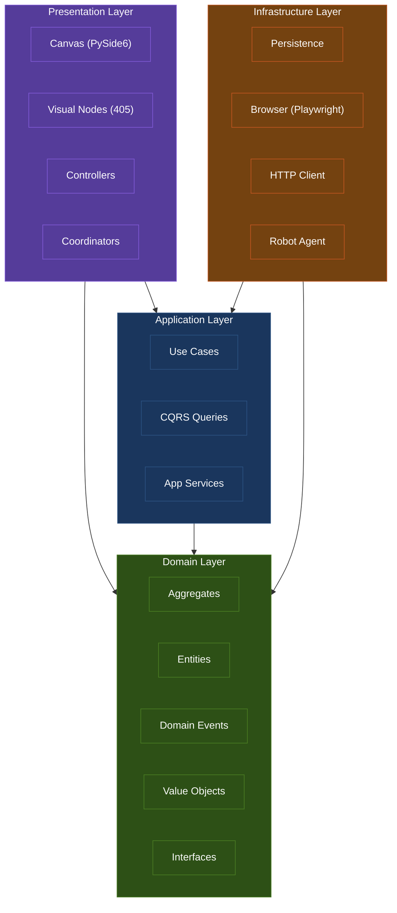

## Component Diagram

Shows the three main applications and their relationships.

```mermaid
graph LR
    subgraph Designer ["Canvas (Designer)"]
        MainWindow["Main Window"]
        NodeEditor["Node Editor"]
        PropertyPanel["Property Panel"]
        DebugPanel["Debug Panel"]
    end

    subgraph Executor ["Robot (Executor)"]
        RobotAgent["Robot Agent"]
        JobExecutor["Job Executor"]
        Heartbeat["Heartbeat Service"]
    end

    subgraph Manager ["Orchestrator (Manager)"]
        API["FastAPI Server"]
        JobQueue["Job Queue"]
        RobotRegistry["Robot Registry"]
        Scheduler["Scheduler"]
    end

    subgraph Shared ["Shared Domain"]
        Workflows["Workflows"]
        Nodes["Nodes (413+)"]
        Events["Domain Events"]
    end

    Designer --> Shared
    Executor --> Shared
    Manager --> Shared

    Designer -.->|"Submit Job"| Manager
    Manager -.->|"Assign Job"| Executor
    Executor -.->|"Report Status"| Manager

    classDef canvasStyle fill:#553c9a,stroke:#805ad5,color:#fff
    classDef robotStyle fill:#2d5016,stroke:#4a7c23,color:#fff
    classDef orchStyle fill:#744210,stroke:#c05621,color:#fff
    classDef sharedStyle fill:#1a365d,stroke:#2c5282,color:#fff

    class Designer,MainWindow,NodeEditor,PropertyPanel,DebugPanel canvasStyle
    class Executor,RobotAgent,JobExecutor,Heartbeat robotStyle
    class Manager,API,JobQueue,RobotRegistry,Scheduler orchStyle
    class Shared,Workflows,Nodes,Events sharedStyle
```

## Event Flow Sequence Diagram

Shows how domain events flow through the system.

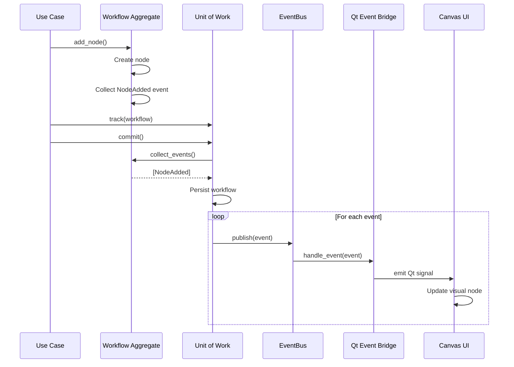

## Workflow Execution Flow

Shows the execution of a workflow from start to finish.

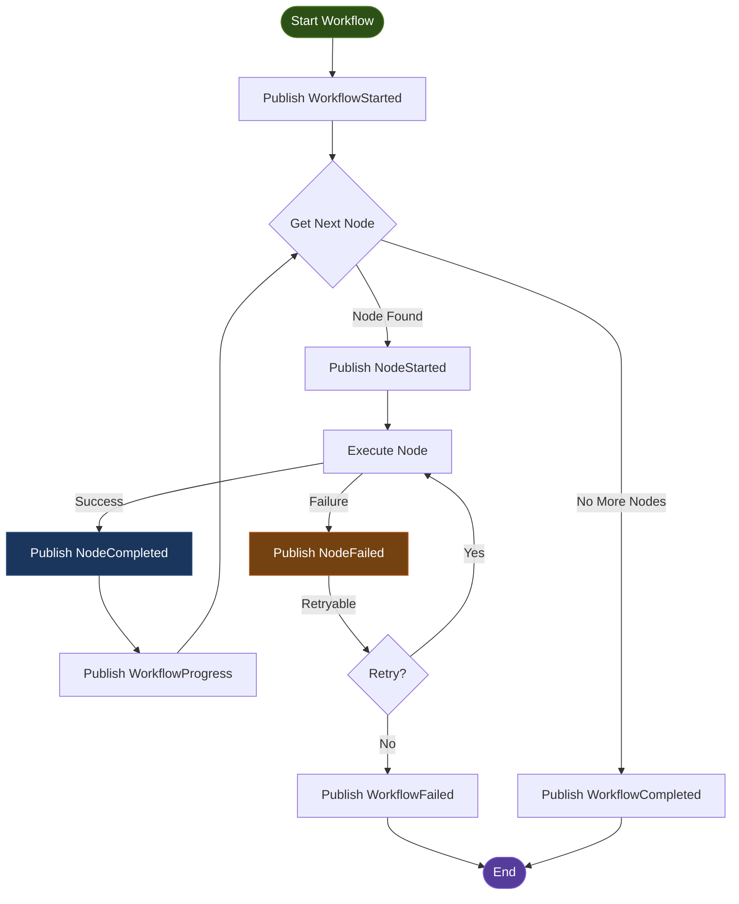

## Node Execution Sequence

Detailed sequence for executing a single node.

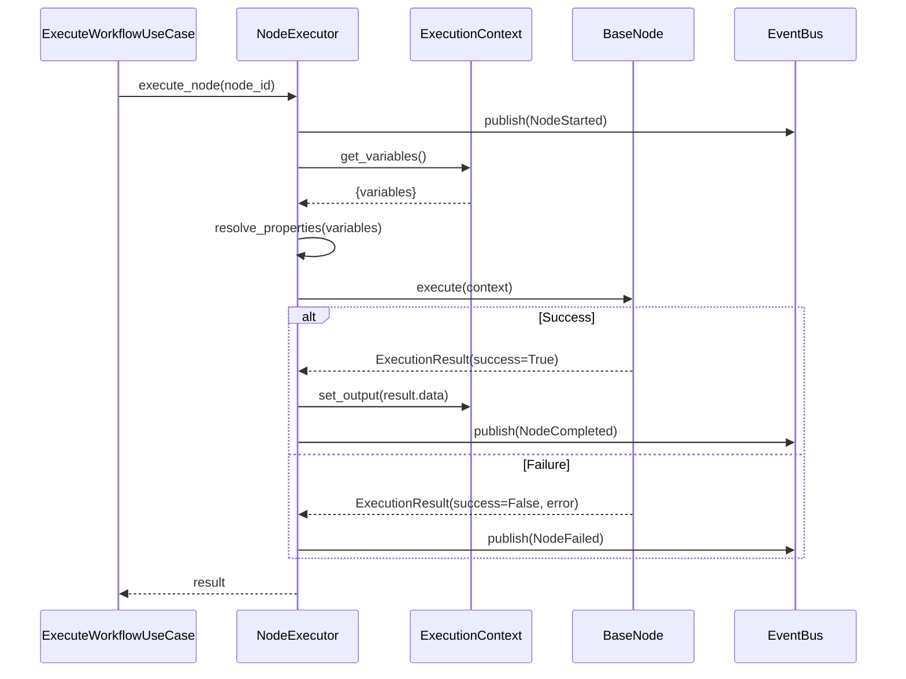

## Aggregate Structure

Shows the internal structure of the Workflow aggregate.

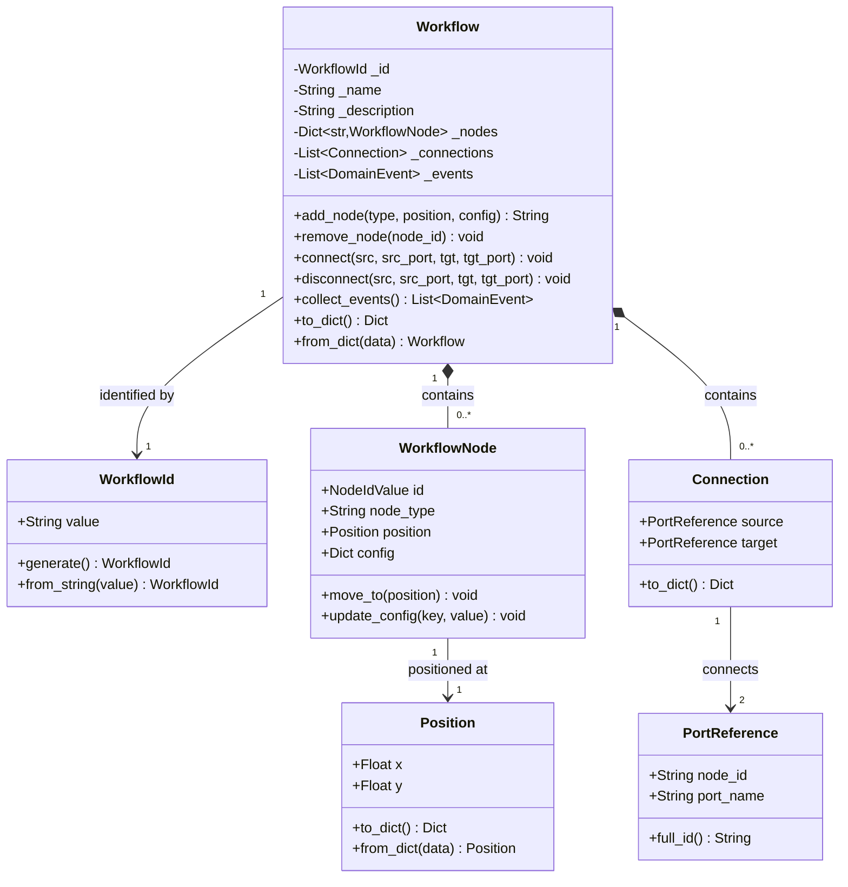

## Domain Events Hierarchy

Shows the event class hierarchy.

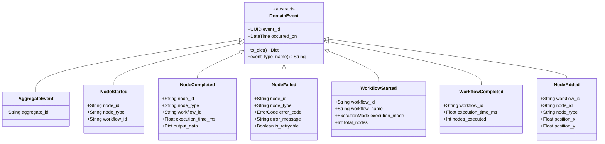

## Unit of Work Flow

Shows how Unit of Work manages transactions and event publishing.

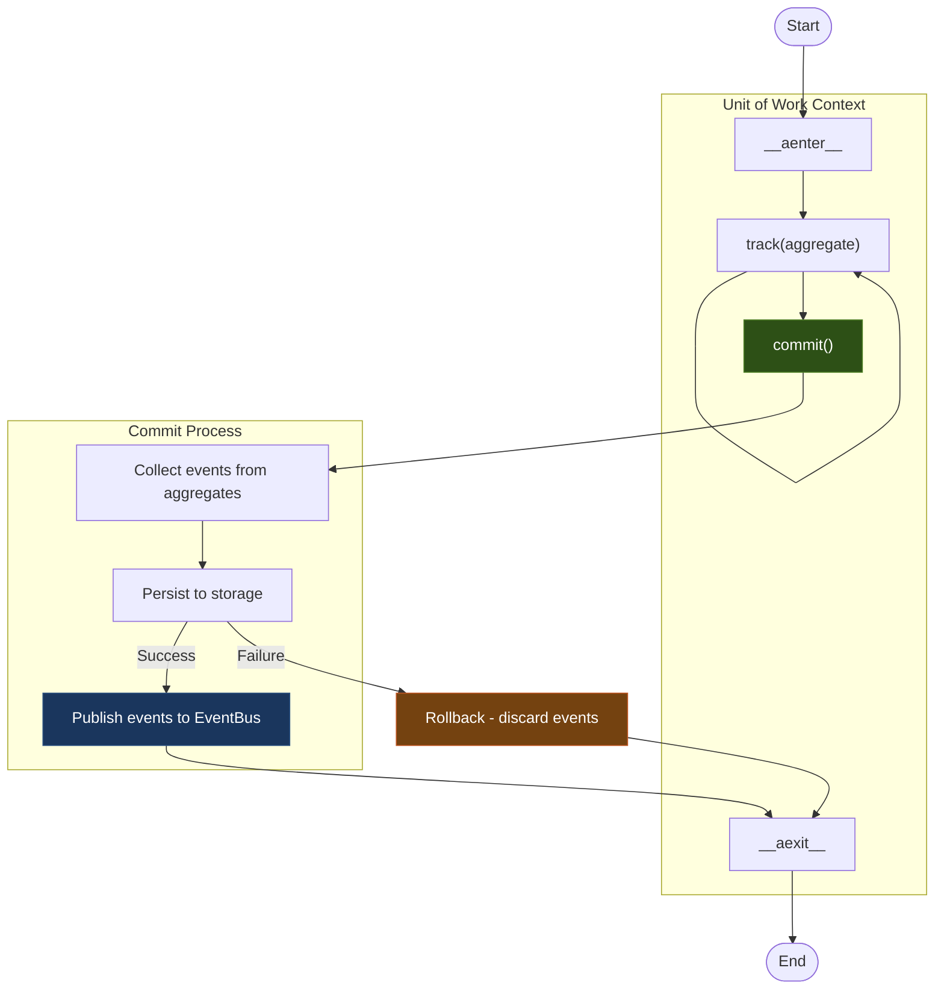

## Qt Event Bridge

Shows how domain events are bridged to Qt signals.

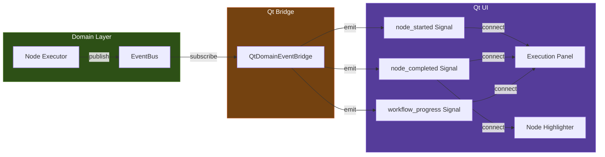

## Visual Node Architecture

Shows the relationship between domain nodes and visual nodes.

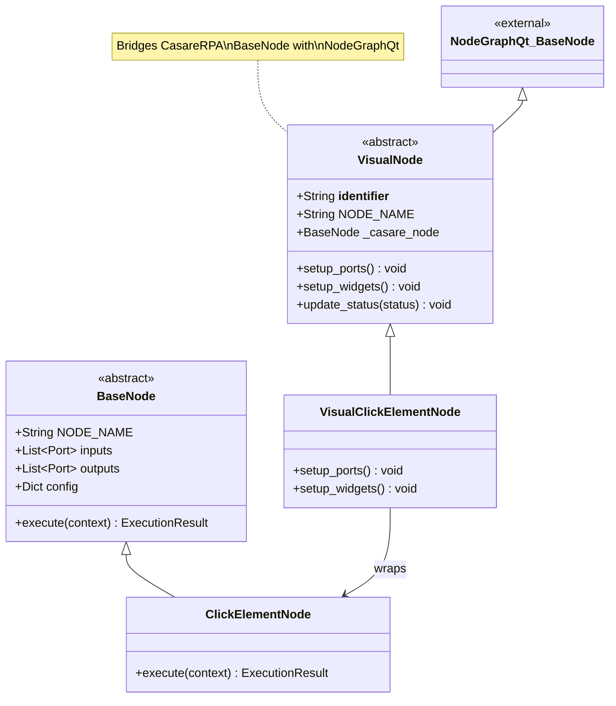

## Data Flow: Canvas to Robot

Shows how a workflow flows from design to execution.

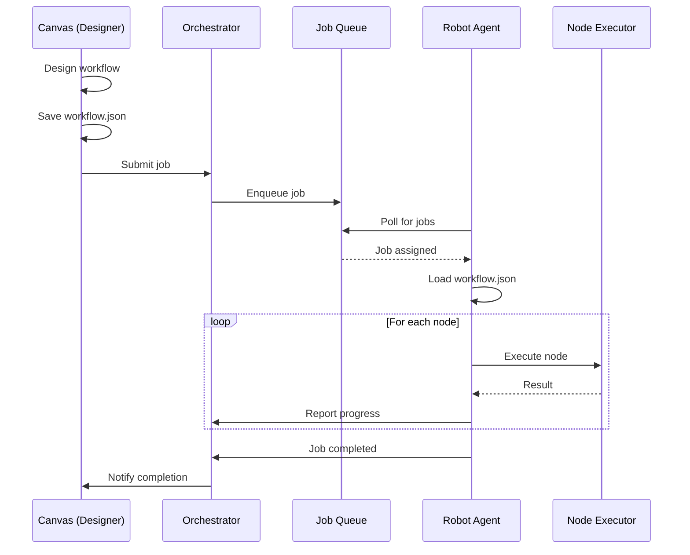

## Viewing These Diagrams

These Mermaid diagrams can be rendered in:

1. **GitHub/GitLab**: Markdown files with Mermaid blocks render automatically
2. **VS Code**: Install "Markdown Preview Mermaid Support" extension
3. **Online**: Use [Mermaid Live Editor](https://mermaid.live)
4. **Documentation**: Most static site generators support Mermaid

## Related Documentation

- [Overview](overview.md) - Architecture overview
- [Layers](layers.md) - Layer documentation
- [Events](events.md) - Typed domain events reference
- [Aggregates](aggregates.md) - Workflow aggregate pattern
