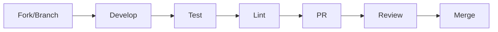

# Contributing to CasareRPA

Guide for developers contributing to the CasareRPA platform.

---

## In This Section

| Document | Description |
|----------|-------------|
| [Development Setup](setup.md) | Environment configuration |
| [Coding Standards](coding-standards.md) | Code style and conventions |
| [Testing](testing.md) | Test strategies and patterns |
| [Pull Requests](pull-requests.md) | PR workflow and review process |
| [Release Process](release-process.md) | Versioning and releases |

---

## Quick Start

### 1. Clone and Setup

```bash
# Clone the repository
git clone https://github.com/your-org/casare-rpa.git
cd casare-rpa

# Create virtual environment
python -m venv .venv
.venv\Scripts\activate  # Windows

# Install in development mode
pip install -e ".[dev]"

# Install pre-commit hooks
pre-commit install
```

### 2. Run Tests

```bash
# All tests
pytest tests/ -v

# Specific test file
pytest tests/nodes/test_basic_nodes.py -v

# With coverage
pytest tests/ --cov=casare_rpa --cov-report=html
```

### 3. Start Development

```bash
# Run the application
python run.py

# Run with debug logging
python run.py --debug
```

---

## Development Workflow



### Branch Naming

| Type | Pattern | Example |
|------|---------|---------|
| Feature | `feature/description` | `feature/telegram-nodes` |
| Bug Fix | `fix/description` | `fix/browser-timeout` |
| Docs | `docs/description` | `docs/api-reference` |
| Refactor | `refactor/description` | `refactor/event-bus` |

### Commit Messages

```
type(scope): short description

Longer description if needed.

🤖 Generated with [Claude Code](https://claude.com/claude-code)

Co-Authored-By: Claude Opus 4.5 <noreply@anthropic.com>
```

**Types:** `feat`, `fix`, `docs`, `refactor`, `test`, `chore`

---

## Code Quality

### Pre-commit Hooks

```yaml
# .pre-commit-config.yaml
repos:
  - repo: https://github.com/astral-sh/ruff-pre-commit
    hooks:
      - id: ruff
      - id: ruff-format
  - repo: https://github.com/pre-commit/mirrors-mypy
    hooks:
      - id: mypy
```

### Type Checking

```bash
# Run mypy
mypy src/casare_rpa --strict
```

### Linting

```bash
# Run ruff
ruff check src/casare_rpa
ruff format src/casare_rpa
```

---

## Project Structure

```
casare_rpa/
├── domain/           # Core business logic (no dependencies)
├── application/      # Use cases and services
├── infrastructure/   # External adapters
├── presentation/     # UI and CLI
└── nodes/           # Automation nodes
```

---

## Getting Help

- **Questions**: Open a GitHub Discussion
- **Bugs**: Open a GitHub Issue
- **Security**: Email security@casarerpa.com

---

## Related Documentation

- [Architecture Overview](../architecture/overview.md)
- [Extending CasareRPA](../extending/index.md)
- [Testing Guide](testing.md)
