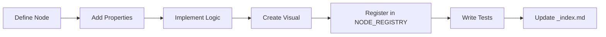

# Extending CasareRPA

Learn how to extend CasareRPA with custom nodes, triggers, visual components, and integrations.

---

## In This Section

| Document | Description |
|----------|-------------|
| [Creating Nodes](creating-nodes.md) | Build custom automation nodes |
| [Creating Triggers](creating-triggers.md) | Implement custom workflow triggers |
| [Visual Nodes](visual-nodes.md) | Create canvas representations |
| [Custom Widgets](custom-widgets.md) | Build property editor widgets |

---

## Extension Points

CasareRPA provides multiple extension points for customization:

### 1. Custom Nodes

Add new automation capabilities by creating nodes:

```python
from casare_rpa.domain.decorators import node, properties
from casare_rpa.domain.schemas import PropertyDef, PropertyType
from casare_rpa.nodes.base_node import BaseNode

@node(category="custom")
@properties(
    PropertyDef("my_param", PropertyType.STRING, essential=True),
)
class MyCustomNode(BaseNode):
    async def execute_impl(self, context):
        param = self.get_property("my_param")
        # Your automation logic here
        return {"result": f"Processed: {param}"}
```

### 2. Custom Triggers

Create workflow triggers for new event sources:

```python
from casare_rpa.triggers.base import BaseTrigger

class MyCustomTrigger(BaseTrigger):
    async def start(self):
        # Set up event listener
        pass

    async def stop(self):
        # Clean up
        pass
```

### 3. Visual Nodes

Design canvas representations for your nodes:

```python
from casare_rpa.presentation.canvas.visual_nodes.base_visual_node import BaseVisualNode

class VisualMyCustomNode(BaseVisualNode):
    def __init__(self):
        super().__init__(MyCustomNode)
```

### 4. Property Widgets

Build custom property editors:

```python
from PySide6.QtWidgets import QWidget

class MyCustomWidget(QWidget):
    def __init__(self, property_def):
        super().__init__()
        # Build your UI
```

---

## Development Workflow



### 7-Step Node Checklist

1. Create node class with `@node` decorator
2. Define properties with `@properties` decorator
3. Export `PropertyDef` constants
4. Create visual node class
5. Write unit tests
6. Export from `__init__.py`
7. Add to `NODE_REGISTRY` (`src/casare_rpa/nodes/registry_data.py`)

---

## Quick Start

| Goal | Start Here |
|------|------------|
| Add automation capability | [Creating Nodes](creating-nodes.md) |
| Create event trigger | [Creating Triggers](creating-triggers.md) |
| Design canvas visuals | [Visual Nodes](visual-nodes.md) |
| Build property editors | [Custom Widgets](custom-widgets.md) |

---

## Related Documentation

- [Architecture Overview](../architecture/overview.md)
- [Node Reference](../../reference/nodes/index.md)
- [Trigger Reference](../../reference/triggers/index.md)
- [Testing Guide](../contributing/testing.md)
