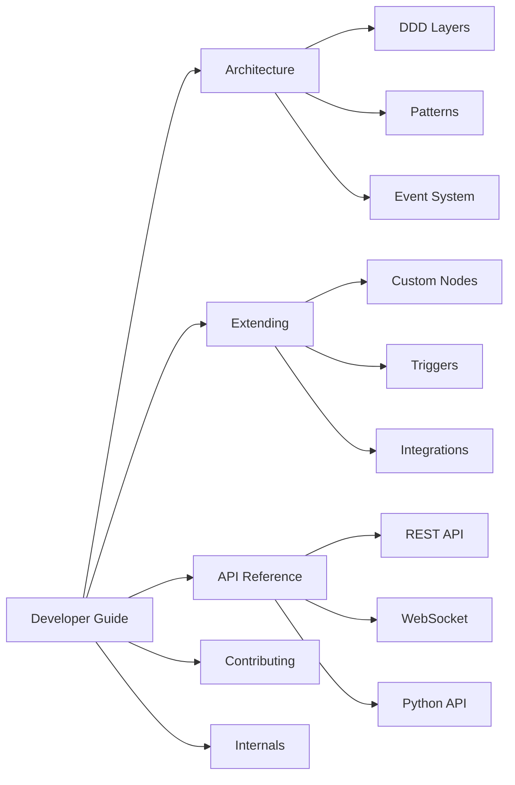
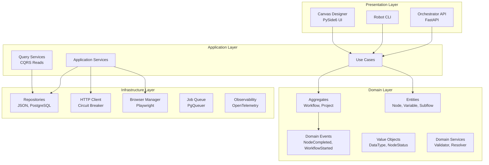

# Developer Guide

Welcome to the CasareRPA Developer Guide. This guide is designed for contributors and integrators who want to understand the architecture, extend the platform, or integrate with external systems.

---

## Who Is This For?

- **Contributors** - Develop new features and fix bugs in CasareRPA
- **Node Developers** - Create custom automation nodes
- **Integration Developers** - Connect CasareRPA with external systems
- **DevOps Engineers** - Deploy and operate the Orchestrator

---

## Guide Sections



### [Architecture](architecture/index.md)

Understand the CasareRPA architecture and design decisions.

| Topic | Description |
|-------|-------------|
| [Overview](architecture/overview.md) | High-level architecture and components |
| [DDD Layers](architecture/ddd-layers.md) | Domain, Application, Infrastructure, Presentation |
| [Design Patterns](architecture/patterns.md) | Repository, Unit of Work, CQRS, Event Sourcing |
| [Event System](architecture/events.md) | Typed domain events and EventBus |
| [Three Applications](architecture/applications.md) | Canvas, Robot, Orchestrator |
| [Technology Stack](architecture/tech-stack.md) | Python, PySide6, Playwright, PostgreSQL |

### [Extending](extending/index.md)

Extend CasareRPA with custom components.

| Topic | Description |
|-------|-------------|
| [Custom Nodes](extending/custom-nodes.md) | Create new automation nodes |
| [Node Properties](extending/node-properties.md) | Define configurable properties |
| [Visual Nodes](extending/visual-nodes.md) | Canvas representation of nodes |
| [Custom Triggers](extending/custom-triggers.md) | Create new trigger types |
| [Resource Managers](extending/resource-managers.md) | Manage external resources |
| [Integrations](extending/integrations.md) | Connect with third-party services |

### [API Reference](api-reference/index.md)

Complete API documentation for programmatic access.

| API | Description |
|-----|-------------|
| [REST API](api-reference/rest-api.md) | Orchestrator HTTP endpoints |
| [WebSocket API](api-reference/websocket-api.md) | Real-time workflow events |
| [Python API](api-reference/python-api.md) | Programmatic workflow execution |
| [CLI Reference](api-reference/cli.md) | Command-line interface |
| [Authentication](api-reference/authentication.md) | API keys and OAuth |

### [Contributing](contributing/index.md)

Contribute to CasareRPA development.

| Topic | Description |
|-------|-------------|
| [Development Setup](contributing/setup.md) | Configure your development environment |
| [Code Style](contributing/code-style.md) | Formatting, linting, and conventions |
| [Testing](contributing/testing.md) | Unit, integration, and E2E tests |
| [Pull Requests](contributing/pull-requests.md) | PR guidelines and review process |
| [Documentation](contributing/documentation.md) | Writing and updating docs |

### [Internals](internals/index.md)

Deep dives into CasareRPA subsystems.

| Topic | Description |
|-------|-------------|
| [Execution Engine](internals/execution-engine.md) | Workflow execution lifecycle |
| [Browser Manager](internals/browser-manager.md) | Playwright integration |
| [Selector Healing](internals/selector-healing.md) | Self-healing selector system |
| [Variable Resolution](internals/variable-resolution.md) | Expression evaluation |
| [Job Queue](internals/job-queue.md) | PostgreSQL-based job processing |
| [Observability](internals/observability.md) | Logging, metrics, and tracing |

---

## Architecture Overview

CasareRPA follows Domain-Driven Design (DDD) 2025 patterns:



### Layer Responsibilities

| Layer | Responsibility | Key Components |
|-------|----------------|----------------|
| **Domain** | Pure business logic, no external dependencies | Entities, Aggregates, Events, Value Objects |
| **Application** | Use cases, orchestration, queries | ExecuteWorkflowUseCase, QueryServices |
| **Infrastructure** | External adapters, persistence | Repositories, HTTP Client, Browser Manager |
| **Presentation** | User interfaces, API endpoints | Canvas UI, CLI, REST API |

### Key Patterns

| Pattern | Location | Purpose |
|---------|----------|---------|
| **Typed Events** | `domain/events/` | Immutable domain events (frozen dataclasses) |
| **EventBus** | `domain/events.py` | Publish-subscribe event distribution |
| **Aggregates** | `domain/aggregates/` | Consistency boundaries (Workflow, Project) |
| **Unit of Work** | `infrastructure/persistence/unit_of_work.py` | Transactional operations with event publishing |
| **CQRS** | `application/queries/` | Read-optimized query services |
| **Repository** | `infrastructure/persistence/` | Abstract data access |

---

## Quick Start: Custom Node

Create a new automation node in 5 steps:

```python
# 1. Define the node with decorators
from casare_rpa.domain.decorators import node, properties
from casare_rpa.domain.schemas import PropertyDef, PropertyType
from casare_rpa.domain.entities import BaseNode
from casare_rpa.domain.value_objects import DataType

@properties(
    PropertyDef("message", PropertyType.STRING, essential=True),
    PropertyDef("count", PropertyType.INTEGER, default=1),
)
@node(category="custom")
class HelloWorldNode(BaseNode):
    """Prints a message multiple times."""

    # 2. Define output ports
    output_ports = [
        {"name": "result", "type": DataType.STRING},
    ]

    # 3. Implement execute method
    async def execute(self, context):
        # MODERN: Use get_parameter() for dual-source access
        message = self.get_parameter("message", "Hello")
        count = self.get_parameter("count", 1)

        result = "\n".join([message] * count)

        # 4. Set output and return success
        self.set_output("result", result)
        return {"success": True}
```

```python
# 5. Register in src/casare_rpa/nodes/registry_data.py
NODE_REGISTRY = {
    # ... existing nodes ...
    "HelloWorldNode": "custom_nodes",
}
```

See [Custom Nodes Guide](extending/custom-nodes.md) for complete documentation.

---

## Quick Start: REST API

The Orchestrator exposes a REST API for workflow management:

```bash
# List workflows
curl -X GET http://localhost:8000/api/v1/workflows \
  -H "Authorization: Bearer <api-key>"

# Submit a job
curl -X POST http://localhost:8000/api/v1/jobs \
  -H "Authorization: Bearer <api-key>" \
  -H "Content-Type: application/json" \
  -d '{"workflow_id": "abc123", "parameters": {}}'

# Get job status
curl -X GET http://localhost:8000/api/v1/jobs/<job-id> \
  -H "Authorization: Bearer <api-key>"
```

See [REST API Reference](api-reference/rest-api.md) for complete documentation.

---

## Development Setup

```bash
# Clone repository
git clone https://github.com/your-org/casare-rpa.git
cd casare-rpa

# Create virtual environment
python -m venv .venv
.venv\Scripts\activate  # Windows

# Install in development mode
pip install -e ".[dev]"

# Run tests
pytest tests/ -v

# Launch the canvas
python run.py
```

### Project Structure

```
casare-rpa/
    src/casare_rpa/
        domain/              # Domain layer
            aggregates/      # Workflow, Project aggregates
            entities/        # BaseNode, Variable, Subflow
            events/          # Typed domain events
            value_objects/   # DataType, NodeStatus, Port
            services/        # Validators, resolvers
            schemas/         # PropertyDef, NodeSchema
        application/         # Application layer
            use_cases/       # ExecuteWorkflow, CreateProject
            queries/         # CQRS query services
            services/        # Cross-cutting services
        infrastructure/      # Infrastructure layer
            persistence/     # JSON, PostgreSQL repositories
            browser/         # Playwright manager
            http/            # Unified HTTP client
            queue/           # Job queue
            observability/   # Logging, metrics
        presentation/        # Presentation layer
            canvas/          # PySide6 visual designer
        nodes/               # 413+ automation nodes
        triggers/            # Trigger implementations
    docs/                    # Documentation
    tests/                   # Test suite
    examples/                # Sample workflows
```

---

## Key Technologies

| Technology | Purpose | Version |
|------------|---------|---------|
| **Python** | Core language | 3.12+ |
| **PySide6** | Desktop UI | 6.6+ |
| **Playwright** | Browser automation | 1.40+ |
| **uiautomation** | Windows UI automation | 2.0+ |
| **FastAPI** | Orchestrator API | 0.100+ |
| **PostgreSQL** | Job queue, persistence | 15+ |
| **OpenTelemetry** | Observability | 1.20+ |

---

## Getting Help

- **Architecture Questions**: See [Architecture](architecture/index.md)
- **Code Examples**: Check `examples/` directory
- **API Docs**: See [API Reference](api-reference/index.md)
- **Issues**: Report on GitHub

---

## Next Steps

- New to the codebase? Start with [Architecture Overview](architecture/overview.md)
- Building a custom node? See [Custom Nodes Guide](extending/custom-nodes.md)
- Integrating with the API? See [REST API Reference](api-reference/rest-api.md)
- Ready to contribute? See [Development Setup](contributing/setup.md)
