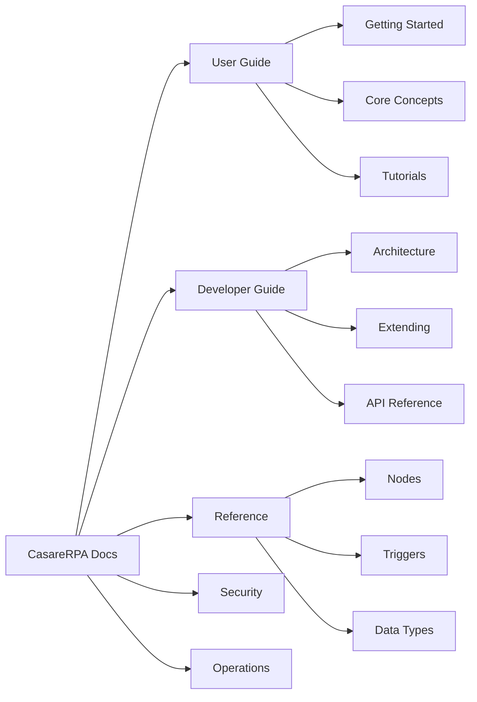
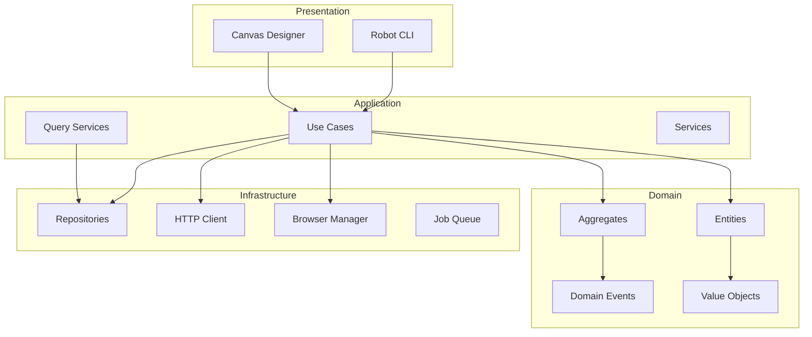

# CasareRPA Documentation

**Windows RPA Platform | Python 3.12 | PySide6 | Playwright | DDD 2025 Architecture**

Welcome to CasareRPA, a professional-grade Robotic Process Automation platform built for Windows environments. CasareRPA combines visual workflow design with powerful automation capabilities to help you automate repetitive tasks across web browsers, desktop applications, files, emails, and more.

---

## Key Features

| Feature | Description |
|---------|-------------|
| **413+ Automation Nodes** | Comprehensive library covering browser, desktop, data, HTTP, email, and system automation |
| **20+ Trigger Types** | Schedule, webhook, file watch, email, Telegram, WhatsApp, Google integrations, and more |
| **Visual Canvas Designer** | Drag-and-drop workflow editor with real-time execution preview |
| **DDD 2025 Architecture** | Clean architecture with typed domain events, aggregates, and CQRS patterns |
| **Multi-Robot Orchestration** | Distribute workflows across multiple execution agents |
| **AI-Powered Generation** | Generate workflows from natural language descriptions |
| **Self-Healing Selectors** | Automatic selector recovery when web elements change |

---

## Documentation Sections



### [User Guide](user-guide/index.md)

For workflow designers and automation operators. Learn to build, run, and manage RPA workflows.

- [Getting Started](user-guide/getting-started/index.md) - Installation and first workflow
- [Core Concepts](user-guide/core-concepts/index.md) - Nodes, connections, variables, triggers
- [Tutorials](user-guide/tutorials/index.md) - Step-by-step automation examples
- [Guides](user-guide/guides/index.md) - Best practices and advanced techniques
- [Deployment](user-guide/deployment/index.md) - Robot agents and orchestration

### [Developer Guide](developer-guide/index.md)

For contributors and integrators. Understand the architecture and extend the platform.

- [Architecture](developer-guide/architecture/index.md) - DDD layers, patterns, and decisions
- [Extending](developer-guide/extending/index.md) - Create custom nodes, triggers, and integrations
- [API Reference](developer-guide/api-reference/index.md) - Orchestrator REST API
- [Contributing](developer-guide/contributing/index.md) - Development setup and guidelines
- [Internals](developer-guide/internals/index.md) - Deep dives into subsystems

### [Reference](reference/index.md)

Complete reference documentation for all platform components.

- [Node Reference](reference/nodes/index.md) - All 413+ automation nodes
- [Trigger Reference](reference/triggers/index.md) - All 20+ trigger types
- [Data Types](reference/data-types/index.md) - Port types and data formats
- [Property Types](reference/property-types/index.md) - Node configuration schemas
- [Error Codes](reference/error-codes/index.md) - Error dictionary and troubleshooting

### [Security](security/index.md)

Security architecture, authentication, and best practices.

- [Security Architecture](security/architecture.md) - Defense layers and threat model
- [Authentication](security/authentication.md) - API keys, OAuth, and robot auth
- [Credentials Management](security/credentials.md) - Vault integration and secrets
- [Best Practices](security/best-practices.md) - Secure workflow design

### [Operations](operations/index.md)

Operational guides for production deployments.

- [Runbook](operations/runbook.md) - Standard operating procedures
- [Troubleshooting](operations/troubleshooting.md) - Common issues and solutions
- [Backup & Restore](operations/backup-restore.md) - Data protection procedures

---

## Quick Start

```bash
# Install CasareRPA
pip install casare-rpa

# Launch the visual designer
python run.py

# Or run headlessly with CLI
casare-rpa run workflow.json
```

### Your First Workflow

1. **Launch Canvas**: Run `python run.py` to open the visual designer
2. **Add Nodes**: Drag nodes from the palette onto the canvas
3. **Connect Nodes**: Draw connections between node ports
4. **Configure**: Set node properties in the right panel
5. **Execute**: Press F5 or click Run to execute the workflow

---

## Architecture Overview

CasareRPA follows Domain-Driven Design (DDD) 2025 patterns with clean layer separation:



| Layer | Responsibility | Dependencies |
|-------|----------------|--------------|
| **Presentation** | UI, CLI, API endpoints | Application |
| **Application** | Use cases, queries, orchestration | Domain |
| **Domain** | Business logic, entities, events | None |
| **Infrastructure** | External adapters, persistence | Domain, Application |

---

## Node Categories

| Category | Nodes | Description |
|----------|-------|-------------|
| **Browser** | 50+ | Web automation with Playwright |
| **Desktop** | 40+ | Windows UI automation |
| **Data** | 30+ | JSON, CSV, XML processing |
| **HTTP** | 15+ | REST API integration |
| **Email** | 12+ | SMTP, IMAP, Gmail, Outlook |
| **File** | 25+ | File system operations |
| **Database** | 10+ | SQL queries and connections |
| **Google** | 25+ | Sheets, Drive, Docs, Calendar |
| **Control Flow** | 20+ | Loops, conditionals, error handling |
| **System** | 30+ | Process, clipboard, dialogs |

---

## Support

- **GitHub Issues**: Report bugs and request features
- **Documentation**: You are here
- **Examples**: See `examples/` directory for sample workflows

---

**Version**: 1.0.0
**License**: Proprietary
**Python**: 3.12+
**Platform**: Windows
