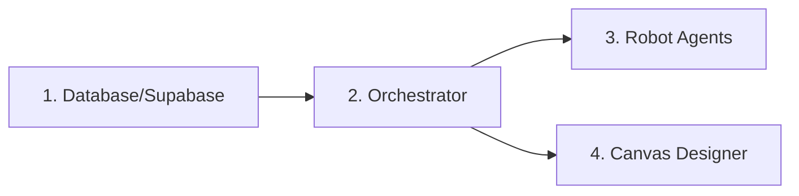
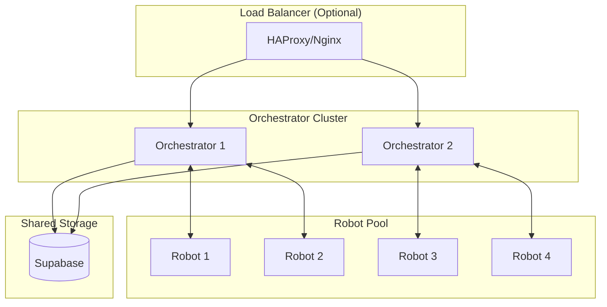
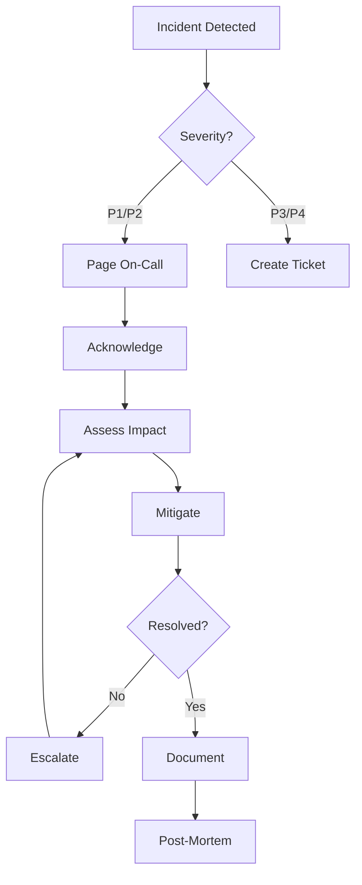

# CasareRPA Operations Runbook

This runbook provides operational procedures for deploying, managing, and maintaining the CasareRPA platform.

## Table of Contents

1. [System Startup](#system-startup)
2. [System Shutdown](#system-shutdown)
3. [Scaling Procedures](#scaling-procedures)
4. [Backup and Recovery](#backup-and-recovery)
5. [Monitoring](#monitoring)
6. [Maintenance Procedures](#maintenance-procedures)
7. [Incident Response](#incident-response)

---

## System Startup

### Pre-Flight Checklist

Before starting CasareRPA components, verify:

- [ ] Python 3.12+ installed
- [ ] Virtual environment activated
- [ ] Dependencies installed (`pip install -e .`)
- [ ] Playwright browsers installed (`playwright install chromium`)
- [ ] Environment variables configured
- [ ] Network ports available (8765, 8766)
- [ ] Supabase credentials valid (if using cloud)

### Starting the Orchestrator

```powershell
# 1. Navigate to project directory
cd C:\Users\Rau\Desktop\CasareRPA

# 2. Activate virtual environment
.\.venv\Scripts\Activate.ps1

# 3. Start Orchestrator
python -m casare_rpa.infrastructure.orchestrator.server

# Or with specific configuration
python -m casare_rpa.infrastructure.orchestrator.server --host 0.0.0.0 --port 8765
```

**Verification:**
```powershell
# Check if server is listening
netstat -an | findstr "8765"
# Expected: TCP    0.0.0.0:8765    LISTENING
```

### Starting Robot Agents

```powershell
# On each robot machine

# 1. Navigate to project directory
cd C:\RPA\CasareRPA

# 2. Activate virtual environment
.\.venv\Scripts\Activate.ps1

# 3. Configure robot (first time only)
# Edit robot_config.yaml or set environment variables

# 4. Start robot agent
python -m casare_rpa.robot.agent

# Or connect to specific orchestrator
python -m casare_rpa.robot.agent --orchestrator ws://orchestrator-host:8765
```

**Verification:**
```powershell
# Check robot registration in Orchestrator logs
# Expected: "Robot 'Robot-Name' (robot-uuid) registered"
```

### Starting the Canvas (Designer)

```powershell
# On designer workstation

cd C:\Users\Rau\Desktop\CasareRPA
.\.venv\Scripts\Activate.ps1
python run.py

# Or directly
python -m casare_rpa.presentation.canvas
```

### Startup Order



**Important:** Always start the Orchestrator before Robot Agents to ensure proper registration.

---

## System Shutdown

### Graceful Shutdown Procedure

#### Step 1: Stop New Job Submissions

```python
# Via Orchestrator API
await engine.pause_job_submissions()
```

Or disable triggers in the UI.

#### Step 2: Wait for Running Jobs

```python
# Check running jobs
running_jobs = engine.get_queue_stats()["running"]
print(f"Waiting for {running_jobs} jobs to complete...")

# Wait with timeout
import asyncio
await asyncio.wait_for(engine.wait_for_completion(), timeout=300)
```

#### Step 3: Disconnect Robots Gracefully

```python
# Send shutdown command to all robots
from casare_rpa.infrastructure.orchestrator.communication.websocket_server import MessageBuilder

for robot_id in engine.connected_robots:
    msg = MessageBuilder.shutdown(robot_id, graceful=True)
    await engine.broadcast(msg)

# Wait for disconnections
await asyncio.sleep(30)
```

#### Step 4: Stop Orchestrator

```python
await engine.stop()
```

Or press `Ctrl+C` in the terminal.

### Emergency Shutdown

For immediate shutdown (may lose in-progress jobs):

```powershell
# Windows
taskkill /F /IM python.exe

# Or kill specific process
taskkill /F /PID <process_id>
```

### Shutdown Checklist

- [ ] All scheduled jobs paused
- [ ] Running jobs completed or checkpointed
- [ ] Robots disconnected gracefully
- [ ] Orchestrator stopped
- [ ] Logs archived if needed

---

## Scaling Procedures

### Adding New Robots

#### Step 1: Prepare Robot Machine

```powershell
# Install Python 3.12+
winget install Python.Python.3.12

# Clone repository or copy installation
git clone https://github.com/org/CasareRPA.git C:\RPA\CasareRPA

# Create virtual environment
cd C:\RPA\CasareRPA
python -m venv .venv
.\.venv\Scripts\Activate.ps1

# Install dependencies
pip install -e .
playwright install chromium
```

#### Step 2: Configure Robot

Create `robot_config.yaml`:

```yaml
robot:
  robot_id: "robot-unique-id"  # Or leave empty for auto-generate
  robot_name: "Production Robot 3"
  environment: "production"
  max_concurrent_jobs: 3
  tags:
    - browser
    - desktop
    - excel

connection:
  url: "https://your-project.supabase.co"
  key: "your-anon-key"
  orchestrator_url: "ws://orchestrator-host:8765"

job_execution:
  checkpoint_enabled: true
  progress_update_interval: 5

observability:
  audit_enabled: true
  resource_monitoring_enabled: true
```

#### Step 3: Register and Start

```powershell
python -m casare_rpa.robot.agent
```

The robot will automatically register with the Orchestrator.

### Horizontal Scaling



### Environment-Based Scaling

Configure robot environments for workload isolation:

```yaml
# Production robots
environment: "production"
max_concurrent_jobs: 1  # Conservative for stability

# Development robots
environment: "development"
max_concurrent_jobs: 5  # More aggressive for testing
```

### Auto-Scaling (Advanced)

For cloud deployments, implement auto-scaling based on queue depth:

```python
async def auto_scale_check():
    stats = engine.get_queue_stats()
    available_robots = engine.available_count

    queued_jobs = stats["queued"]
    jobs_per_robot = 3

    required_robots = (queued_jobs // jobs_per_robot) + 1
    current_robots = len(engine.connected_robots)

    if required_robots > current_robots:
        # Scale up - launch new robot instances
        await launch_robot_instances(required_robots - current_robots)
    elif required_robots < current_robots - 2:
        # Scale down with buffer
        await terminate_idle_robots(current_robots - required_robots - 2)
```

---

## Backup and Recovery

### What to Back Up

| Data | Location | Frequency |
|------|----------|-----------|
| Workflows | `workflows/` directory | Daily |
| Robot configs | `robot_config.yaml` | On change |
| Orchestrator configs | `orchestrator_config.yaml` | On change |
| Job history | Supabase/local DB | Daily |
| Checkpoints | `checkpoints/` | Continuous |
| Audit logs | `logs/audit/` | Weekly |

### Backup Procedure

#### Local Backup Script

```powershell
# backup.ps1
$date = Get-Date -Format "yyyy-MM-dd"
$backupDir = "C:\Backups\CasareRPA\$date"

# Create backup directory
New-Item -ItemType Directory -Force -Path $backupDir

# Backup workflows
Copy-Item -Recurse "C:\Users\Rau\Desktop\CasareRPA\workflows" "$backupDir\workflows"

# Backup configuration
Copy-Item "C:\Users\Rau\Desktop\CasareRPA\*.yaml" "$backupDir\"
Copy-Item "C:\Users\Rau\Desktop\CasareRPA\.env" "$backupDir\" -ErrorAction SilentlyContinue

# Backup checkpoints
Copy-Item -Recurse "C:\Users\Rau\Desktop\CasareRPA\checkpoints" "$backupDir\checkpoints" -ErrorAction SilentlyContinue

# Backup local database
Copy-Item "C:\Users\Rau\Desktop\CasareRPA\*.db" "$backupDir\" -ErrorAction SilentlyContinue

# Compress
Compress-Archive -Path "$backupDir\*" -DestinationPath "C:\Backups\CasareRPA\backup-$date.zip"

# Cleanup directory
Remove-Item -Recurse -Force $backupDir

Write-Host "Backup completed: backup-$date.zip"
```

#### Supabase Backup

Use Supabase dashboard or CLI:

```bash
# Export data
supabase db dump -f backup.sql

# Or via pg_dump
pg_dump $DATABASE_URL > backup.sql
```

### Recovery Procedure

#### Restore from Backup

```powershell
# restore.ps1
param($backupFile)

$restoreDir = "C:\Users\Rau\Desktop\CasareRPA"

# Extract backup
Expand-Archive -Path $backupFile -DestinationPath "C:\Temp\CasareRestore"

# Stop services first
# ... shutdown procedures ...

# Restore workflows
Copy-Item -Recurse -Force "C:\Temp\CasareRestore\workflows\*" "$restoreDir\workflows\"

# Restore configuration
Copy-Item -Force "C:\Temp\CasareRestore\*.yaml" "$restoreDir\"

# Restore checkpoints
Copy-Item -Recurse -Force "C:\Temp\CasareRestore\checkpoints\*" "$restoreDir\checkpoints\"

# Cleanup
Remove-Item -Recurse -Force "C:\Temp\CasareRestore"

Write-Host "Restore completed. Restart services."
```

#### Checkpoint Recovery

To recover a job from checkpoint:

```python
from casare_rpa.robot.checkpoint import CheckpointManager

checkpoint_mgr = CheckpointManager(offline_queue)

# Get checkpoint for job
checkpoint = await checkpoint_mgr.get_checkpoint(job_id)

if checkpoint:
    print(f"Checkpoint found at node: {checkpoint.current_node_id}")
    print(f"Variables: {checkpoint.variables}")

    # Resume execution
    await job_executor.submit_job(
        job_id,
        workflow_json,
        resume_from_checkpoint=True
    )
```

---

## Monitoring

### Health Check Endpoints

```python
# Robot health
robot_status = robot_agent.get_status()
# Returns: {"running": true, "connection": {...}, "job_executor": {...}}

# Orchestrator health
orchestrator_health = engine.get_overall_health()
# Returns: {"overall_status": "healthy", "robots": {...}, "queue": {...}}
```

### Key Metrics to Monitor

| Metric | Warning | Critical | Action |
|--------|---------|----------|--------|
| Queue depth | > 50 | > 100 | Scale up robots |
| Robot CPU | > 80% | > 95% | Check workflows |
| Robot memory | > 80% | > 95% | Restart robot |
| Job failure rate | > 10% | > 25% | Investigate errors |
| Heartbeat missed | 1 | 3 | Check robot |
| Connection failures | > 5/hour | > 20/hour | Check network |

### Log Monitoring

```powershell
# Tail Orchestrator logs
Get-Content "logs\orchestrator.log" -Wait -Tail 50

# Search for errors
Select-String -Path "logs\*.log" -Pattern "ERROR|CRITICAL"

# Monitor robot logs
Get-Content "logs\robot_*.log" -Wait -Tail 50
```

### Dashboard Metrics

The Orchestrator UI provides:

- Active robots and their status
- Job queue depth by priority
- Running jobs and progress
- Historical success rates
- Upcoming scheduled executions

---

## Maintenance Procedures

### Daily Maintenance

- [ ] Check system health dashboard
- [ ] Review failed jobs
- [ ] Verify scheduled jobs executed
- [ ] Check disk space

### Weekly Maintenance

- [ ] Archive old logs
- [ ] Review error patterns
- [ ] Update workflows if needed
- [ ] Test backup restoration

### Monthly Maintenance

- [ ] Update dependencies (`pip install -U -e .`)
- [ ] Update Playwright browsers
- [ ] Review security patches
- [ ] Performance tuning

### Log Rotation

Configure loguru for automatic rotation:

```python
from loguru import logger

logger.add(
    "logs/orchestrator_{time}.log",
    rotation="1 day",
    retention="30 days",
    compression="zip"
)
```

### Database Maintenance

```sql
-- Clean up old completed jobs (keep 90 days)
DELETE FROM jobs
WHERE status IN ('completed', 'cancelled')
AND completed_at < NOW() - INTERVAL '90 days';

-- Clean up old logs
DELETE FROM job_logs
WHERE created_at < NOW() - INTERVAL '30 days';

-- Vacuum database
VACUUM ANALYZE;
```

---

## Incident Response

### Severity Levels

| Level | Description | Response Time | Examples |
|-------|-------------|---------------|----------|
| P1 | Critical | 15 minutes | All robots offline, data loss |
| P2 | High | 1 hour | Job failures > 50%, one robot down |
| P3 | Medium | 4 hours | Degraded performance, minor errors |
| P4 | Low | 24 hours | UI issues, documentation |

### Incident Response Flowchart



### Common Incidents

#### All Robots Offline

1. Check network connectivity
2. Verify Orchestrator is running
3. Check Supabase status
4. Review robot logs for errors
5. Restart Orchestrator if needed
6. Restart robots one by one

#### High Job Failure Rate

1. Check recent workflow changes
2. Review error messages
3. Test target applications manually
4. Check for selector changes
5. Verify credentials
6. Roll back recent changes if needed

#### Orchestrator Unresponsive

1. Check process status
2. Review memory/CPU usage
3. Check for deadlocks in logs
4. Graceful restart if possible
5. Force restart if necessary
6. Verify job recovery from checkpoints

### Escalation Contacts

| Role | Contact | When to Contact |
|------|---------|-----------------|
| On-Call Engineer | [contact] | P1/P2 incidents |
| Team Lead | [contact] | P1 incidents, escalations |
| System Admin | [contact] | Infrastructure issues |

---

## Quick Reference

### Common Commands

```powershell
# Start Orchestrator
python -m casare_rpa.infrastructure.orchestrator.server

# Start Robot
python -m casare_rpa.robot.agent

# Start Canvas
python run.py

# Run tests
pytest tests/ -v

# Check logs
Get-Content logs\*.log -Tail 100

# Check ports
netstat -an | findstr "8765 8766"
```

### Important Paths

| Path | Description |
|------|-------------|
| `workflows/` | Saved workflow files |
| `logs/` | Application logs |
| `checkpoints/` | Job checkpoints |
| `robot_config.yaml` | Robot configuration |
| `.env` | Environment variables |

### Default Ports

| Service | Port |
|---------|------|
| Orchestrator WebSocket | 8765 |
| Trigger Webhooks | 8766 |
| Supabase Realtime | 443 (cloud) |

---

## Related Documentation

- [Troubleshooting Guide](TROUBLESHOOTING.md)
- [System Overview](../architecture/SYSTEM_OVERVIEW.md)
- [API Reference](../api/REST_API_REFERENCE.md)
- [Security Architecture](../security/SECURITY_ARCHITECTURE.md)
