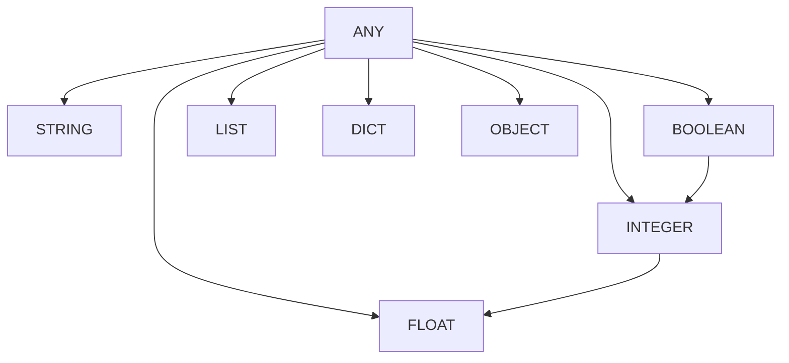

# Data Types Reference

Data types define what kind of data can flow between node ports. CasareRPA uses a rich type system to ensure data compatibility and enable type-aware connections in the visual editor.

---

## Overview

Data types are defined in `casare_rpa.domain.value_objects.types.DataType`:

```python
from casare_rpa.domain.value_objects.types import DataType
```

---

## Primitive Types

### STRING

Text data of any length.

| Property | Value |
|----------|-------|
| Python Type | `str` |
| Default | `""` |
| Example | `"Hello World"` |

**Use Cases:**
- URLs, file paths, selectors
- User input, extracted text
- Configuration values

```python
# Node output
return {"text": "Extracted content"}

# Node input
url = inputs.get("url", "https://example.com")
```

### INTEGER

Whole numbers without decimal places.

| Property | Value |
|----------|-------|
| Python Type | `int` |
| Default | `0` |
| Example | `42` |

**Use Cases:**
- Counts, indices, IDs
- Port numbers, timeouts
- Loop counters

```python
# Loop counter
return {"count": len(items)}

# Timeout configuration
timeout_ms = inputs.get("timeout", 30000)
```

### FLOAT

Floating-point decimal numbers.

| Property | Value |
|----------|-------|
| Python Type | `float` |
| Default | `0.0` |
| Example | `3.14159` |

**Use Cases:**
- Prices, percentages
- Coordinates, measurements
- Scientific values

```python
# Price calculation
return {"total": subtotal * 1.08}  # 8% tax

# Coordinates
x_pos = inputs.get("x", 0.0)
```

### BOOLEAN

True or False values.

| Property | Value |
|----------|-------|
| Python Type | `bool` |
| Default | `False` |
| Example | `True` |

**Use Cases:**
- Conditional logic
- Feature flags
- Validation results

```python
# Validation result
return {"is_valid": len(errors) == 0}

# Conditional check
if inputs.get("skip_validation", False):
    return
```

### LIST

Ordered collection of values.

| Property | Value |
|----------|-------|
| Python Type | `list` |
| Default | `[]` |
| Example | `[1, 2, 3]` |

**Use Cases:**
- Multiple items to process
- Table rows, search results
- Batch operations

```python
# Extract multiple elements
return {"items": [elem.text for elem in elements]}

# Iterate over inputs
for item in inputs.get("items", []):
    process(item)
```

### DICT

Key-value mapping (dictionary/object).

| Property | Value |
|----------|-------|
| Python Type | `dict` |
| Default | `{}` |
| Example | `{"name": "John", "age": 30}` |

**Use Cases:**
- Structured data
- API responses
- Configuration objects

```python
# Return structured data
return {
    "result": {
        "status": "success",
        "data": extracted_data
    }
}

# Access nested data
user = inputs.get("user", {})
name = user.get("name", "Unknown")
```

### ANY

Dynamic type that accepts any value.

| Property | Value |
|----------|-------|
| Python Type | `Any` |
| Default | `None` |
| Example | Any value |

**Use Cases:**
- Generic processing nodes
- Variable storage
- Dynamic transformations

```python
# Pass-through node
value = inputs.get("value")  # Any type
return {"output": transform(value)}
```

---

## Special Types

### EXEC

Execution flow marker - no data, just triggers execution order.

| Property | Value |
|----------|-------|
| Python Type | N/A |
| Default | N/A |
| Example | N/A |

**Use Cases:**
- Control flow connections
- Sequential execution order
- Branching logic

> **Note:** EXEC ports are displayed differently in the canvas (typically as white circles) and cannot carry data.

---

## Browser Automation Types

### PAGE

Playwright page object for browser automation.

| Property | Value |
|----------|-------|
| Python Type | `playwright.async_api.Page` |
| Default | `None` |
| Example | Active browser tab |

**Use Cases:**
- Pass browser context between nodes
- Multi-tab workflows
- Browser state management

```python
# LaunchBrowserNode output
return {"page": await browser.new_page()}

# ClickElementNode input
page = inputs.get("page")
await page.click(selector)
```

### ELEMENT

Reference to a web element.

| Property | Value |
|----------|-------|
| Python Type | `playwright.async_api.ElementHandle` |
| Default | `None` |
| Example | DOM element reference |

**Use Cases:**
- Element chaining
- Dynamic element operations
- Frame handling

```python
# FindElementNode output
element = await page.query_selector(selector)
return {"element": element}

# Subsequent node
element = inputs.get("element")
await element.click()
```

### BROWSER

Playwright browser instance.

| Property | Value |
|----------|-------|
| Python Type | `playwright.async_api.Browser` |
| Default | `None` |
| Example | Browser instance |

**Use Cases:**
- Browser lifecycle management
- Multi-browser workflows
- Resource pooling

---

## Desktop Automation Types

### WINDOW

Windows desktop window handle.

| Property | Value |
|----------|-------|
| Python Type | `uiautomation.WindowControl` |
| Default | `None` |
| Example | Application window |

**Use Cases:**
- Window management
- Focus control
- Window state operations

```python
# FindWindowNode output
window = auto.WindowControl(Name=window_title)
return {"window": window}

# WindowActivateNode input
window = inputs.get("window")
window.SetActive()
```

### DESKTOP_ELEMENT

Desktop UI element (UIAutomation).

| Property | Value |
|----------|-------|
| Python Type | `uiautomation.Control` |
| Default | `None` |
| Example | Button, textbox, etc. |

**Use Cases:**
- Desktop element interaction
- Element property access
- Automation control

```python
# FindElementNode output
element = window.ButtonControl(Name="Submit")
return {"element": element}

# ClickDesktopElementNode input
element = inputs.get("element")
element.Click()
```

---

## Database Types

### DB_CONNECTION

Database connection object.

| Property | Value |
|----------|-------|
| Python Type | `asyncpg.Connection` / `psycopg2.connection` |
| Default | `None` |
| Example | Active database connection |

**Use Cases:**
- Transaction management
- Connection pooling
- Multi-query workflows

```python
# ConnectDatabaseNode output
conn = await asyncpg.connect(dsn)
return {"connection": conn}

# ExecuteSQLNode input
conn = inputs.get("connection")
result = await conn.fetch(query)
```

---

## Office Automation Types

### WORKBOOK

Excel workbook object.

| Property | Value |
|----------|-------|
| Python Type | `openpyxl.Workbook` |
| Default | `None` |
| Example | Open Excel file |

**Use Cases:**
- Excel automation
- Multi-sheet operations
- Workbook manipulation

### WORKSHEET

Excel worksheet object.

| Property | Value |
|----------|-------|
| Python Type | `openpyxl.worksheet.Worksheet` |
| Default | `None` |
| Example | Excel sheet |

**Use Cases:**
- Sheet-level operations
- Cell manipulation
- Data extraction

### DOCUMENT

Word/PDF document object.

| Property | Value |
|----------|-------|
| Python Type | `docx.Document` / `pypdf.PdfReader` |
| Default | `None` |
| Example | Open document |

**Use Cases:**
- Document processing
- Content extraction
- Document generation

---

## Generic Type

### OBJECT

Generic object reference for custom types.

| Property | Value |
|----------|-------|
| Python Type | `object` |
| Default | `None` |
| Example | Any Python object |

**Use Cases:**
- Custom node outputs
- Complex data structures
- External library objects

---

## Type Compatibility

### Automatic Conversions

Some types can be automatically converted:

```
INTEGER --> FLOAT (widening)
BOOLEAN --> INTEGER (True=1, False=0)
Any type --> STRING (via str())
Any type --> ANY (always allowed)
```

### Type Hierarchy



### Connection Rules

| Source Type | Can Connect To |
|-------------|----------------|
| STRING | STRING, ANY |
| INTEGER | INTEGER, FLOAT, ANY |
| FLOAT | FLOAT, ANY |
| BOOLEAN | BOOLEAN, INTEGER, ANY |
| LIST | LIST, ANY |
| DICT | DICT, ANY |
| PAGE | PAGE, ANY |
| ELEMENT | ELEMENT, ANY |
| ANY | All types |

---

## Using Data Types in Nodes

### Defining Input Ports

```python
from casare_rpa.domain.value_objects.types import DataType

class MyNode(BaseNode):
    def __init__(self, node_id: str, config: Dict = None):
        super().__init__(node_id, config)

        # Add typed input ports
        self.add_input_port("text", DataType.STRING, "Input text")
        self.add_input_port("count", DataType.INTEGER, "Repeat count")
        self.add_input_port("items", DataType.LIST, "Items to process")
```

### Defining Output Ports

```python
class MyNode(BaseNode):
    def __init__(self, node_id: str, config: Dict = None):
        super().__init__(node_id, config)

        # Add typed output ports
        self.add_output_port("result", DataType.STRING, "Processed result")
        self.add_output_port("success", DataType.BOOLEAN, "Operation success")
        self.add_output_port("data", DataType.DICT, "Output data")
```

### Returning Data

```python
async def execute(self, inputs: Dict[str, Any], context: ExecutionContext) -> Dict[str, Any]:
    # Process inputs
    text = inputs.get("text", "")
    count = inputs.get("count", 1)

    # Return outputs (types must match port definitions)
    return {
        "result": text * count,
        "success": True,
        "data": {"length": len(text) * count}
    }
```

---

## Best Practices

### 1. Use Specific Types

```python
# Good - specific type
self.add_output_port("count", DataType.INTEGER, "Item count")

# Avoid - too generic
self.add_output_port("count", DataType.ANY, "Item count")
```

### 2. Validate Input Types

```python
async def execute(self, inputs, context):
    items = inputs.get("items", [])

    # Validate type
    if not isinstance(items, list):
        raise ValueError(f"Expected list, got {type(items).__name__}")

    return {"count": len(items)}
```

### 3. Document Port Types

```python
# Docstring should describe types
"""
Inputs:
    url (STRING): Target URL
    timeout (INTEGER): Timeout in milliseconds

Outputs:
    content (STRING): Page content
    status (INTEGER): HTTP status code
"""
```

---

## Related Documentation

- [Property Types](property-types.md) - Configuration types
- [Node Development](../developer-guide/extending/creating-nodes.md) - Creating custom nodes
- [Port Connections](../user-guide/core-concepts/nodes-and-ports.md) - Visual connections
