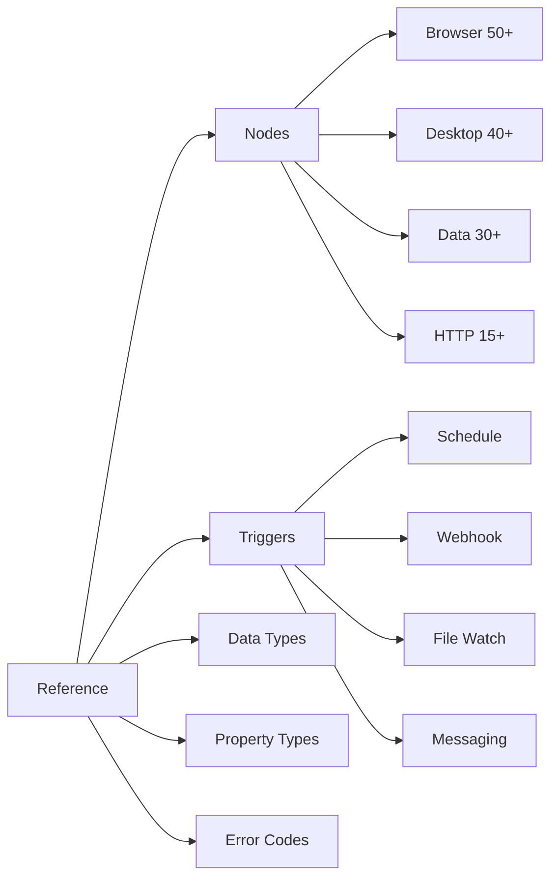
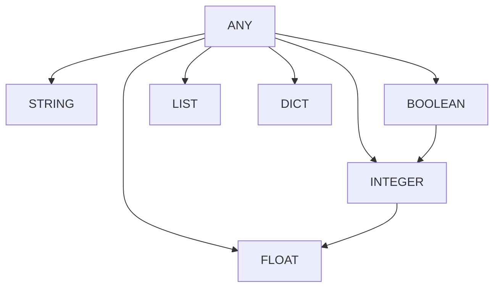

# Reference Documentation

Complete reference documentation for all CasareRPA components. This section provides detailed specifications for nodes, triggers, data types, and error codes.

---

## Reference Sections



---

## [Node Reference](nodes/index.md)

Complete documentation for all 413+ automation nodes.

### Node Categories

| Category | Count | Description | Base Class |
|----------|-------|-------------|------------|
| [Browser](nodes/browser/index.md) | 50+ | Web automation with Playwright | `BrowserBaseNode` |
| [Desktop](nodes/desktop/index.md) | 40+ | Windows UI automation | `DesktopNodeBase` |
| [Data](nodes/data/index.md) | 30+ | JSON, CSV, XML processing | `BaseNode` |
| [HTTP](nodes/http/index.md) | 15+ | REST API integration | `BaseNode` |
| [Email](nodes/email/index.md) | 12+ | SMTP, IMAP, Gmail | `BaseNode` |
| [File](nodes/file/index.md) | 25+ | File system operations | `BaseNode` |
| [Database](nodes/database/index.md) | 10+ | SQL queries and connections | `BaseNode` |
| [Google](nodes/google/index.md) | 25+ | Sheets, Drive, Docs, Calendar | `GoogleBaseNode` |
| [Control Flow](nodes/control-flow/index.md) | 20+ | Loops, conditionals, error handling | `BaseNode` |
| [System](nodes/system/index.md) | 30+ | Process, clipboard, dialogs | `BaseNode` |
| [Variables](nodes/variables/index.md) | 10+ | Get, set, transform variables | `BaseNode` |
| [Messaging](nodes/messaging/index.md) | 15+ | Telegram, WhatsApp | `BaseNode` |
| [Text](nodes/text/index.md) | 20+ | String manipulation | `BaseNode` |
| [Math](nodes/math/index.md) | 10+ | Mathematical operations | `BaseNode` |
| [DateTime](nodes/datetime/index.md) | 8+ | Date and time operations | `BaseNode` |
| [PDF](nodes/pdf/index.md) | 6+ | PDF generation and reading | `BaseNode` |
| [XML](nodes/xml/index.md) | 5+ | XML parsing and generation | `BaseNode` |
| [FTP](nodes/ftp/index.md) | 5+ | FTP/SFTP operations | `BaseNode` |

### Most Used Nodes

| Node | Category | Description |
|------|----------|-------------|
| `LaunchBrowserNode` | Browser | Start browser session |
| `ClickElementNode` | Browser | Click web element |
| `TypeInputNode` | Browser | Type text into field |
| `ExtractTextNode` | Browser | Extract text from element |
| `NavigateNode` | Browser | Navigate to URL |
| `FindElementNode` | Desktop | Find Windows UI element |
| `DesktopClickNode` | Desktop | Click desktop element |
| `ReadFileNode` | File | Read file contents |
| `WriteFileNode` | File | Write to file |
| `HttpRequestNode` | HTTP | Make HTTP request |
| `ForLoopStartNode` | Control Flow | Start loop iteration |
| `IfNode` | Control Flow | Conditional branching |
| `SetVariableNode` | Variables | Set workflow variable |

---

## [Trigger Reference](triggers/index.md)

Complete documentation for all 20+ trigger types.

### Trigger Types

| Trigger | Description | Configuration |
|---------|-------------|---------------|
| [ScheduleTrigger](triggers/schedule.md) | Cron-based time triggers | Cron expression, timezone |
| [WebhookTrigger](triggers/webhook.md) | HTTP endpoint triggers | Path, method, authentication |
| [FileWatchTrigger](triggers/file-watch.md) | File system changes | Path, patterns, events |
| [EmailTrigger](triggers/email.md) | New email arrival | IMAP config, filters |
| [GmailTrigger](triggers/gmail.md) | Gmail-specific trigger | OAuth, label filters |
| [TelegramTrigger](triggers/telegram.md) | Telegram bot messages | Bot token, chat filters |
| [WhatsAppTrigger](triggers/whatsapp.md) | WhatsApp messages | Business API config |
| [SheetsTrigger](triggers/sheets.md) | Google Sheets changes | Sheet ID, range |
| [DriveTrigger](triggers/drive.md) | Google Drive events | Folder ID, file types |
| [CalendarTrigger](triggers/calendar.md) | Google Calendar events | Calendar ID, event types |
| [RSSFeedTrigger](triggers/rss-feed.md) | New RSS feed items | Feed URL, poll interval |
| [SSETrigger](triggers/sse.md) | Server-Sent Events | Endpoint URL |
| [ChatTrigger](triggers/chat.md) | Generic chat messages | Provider config |
| [FormTrigger](triggers/form.md) | Form submissions | Form definition |
| [AppEventTrigger](triggers/app-event.md) | Application events | Event type filters |
| [ErrorTrigger](triggers/error.md) | Workflow error events | Error type filters |
| [WorkflowCallTrigger](triggers/workflow-call.md) | Called from other workflows | Input parameters |

### Trigger Output Data

All triggers provide data to the workflow through a standardized output port:

```python
# Trigger output structure
{
    "trigger_type": "webhook",
    "triggered_at": "2024-01-15T10:30:00Z",
    "data": {
        # Trigger-specific payload
    }
}
```

---

## [Data Types](data-types/index.md)

Port data types used for node connections.

### Core Data Types

| Type | Description | Python Type | Example |
|------|-------------|-------------|---------|
| `STRING` | Text data | `str` | `"Hello World"` |
| `INTEGER` | Whole numbers | `int` | `42` |
| `FLOAT` | Decimal numbers | `float` | `3.14159` |
| `BOOLEAN` | True/False | `bool` | `True` |
| `LIST` | Ordered collection | `list` | `[1, 2, 3]` |
| `DICT` | Key-value mapping | `dict` | `{"key": "value"}` |
| `ANY` | Any type (dynamic) | `Any` | - |

### Specialized Data Types

| Type | Description | Use Case |
|------|-------------|----------|
| `EXEC` | Execution flow | Control flow between nodes |
| `PAGE` | Browser page handle | Pass page between browser nodes |
| `ELEMENT` | UI element reference | Desktop automation elements |
| `FILE_PATH` | File system path | File operations |
| `DATAFRAME` | Tabular data | Data processing |
| `CREDENTIALS` | Credential reference | Secure credential passing |

### Type Compatibility



---

## [Property Types](property-types/index.md)

Node configuration property types for the property panel.

### Property Type Reference

| Type | Widget | Description | Options |
|------|--------|-------------|---------|
| `STRING` | Text input | Single-line text | `placeholder`, `pattern` |
| `TEXT` | Text area | Multi-line text | `placeholder`, `rows` |
| `INTEGER` | Spin box | Whole numbers | `min_value`, `max_value`, `step` |
| `FLOAT` | Double spin box | Decimal numbers | `min_value`, `max_value`, `decimals` |
| `BOOLEAN` | Checkbox | True/False toggle | - |
| `CHOICE` | Dropdown | Selection from options | `choices` (required) |
| `FILE_PATH` | File picker | File selection | `filters`, `mode` |
| `FOLDER_PATH` | Folder picker | Directory selection | - |
| `SELECTOR` | Selector picker | CSS/XPath selector | - |
| `JSON` | Code editor | JSON data | `schema` |
| `CODE` | Code editor | Script code | `language` |
| `COLOR` | Color picker | Color selection | - |
| `PASSWORD` | Password input | Masked text | - |
| `CREDENTIAL` | Credential selector | Credential reference | `credential_type` |

### PropertyDef Options

| Option | Type | Description |
|--------|------|-------------|
| `essential` | `bool` | Keep visible when node collapsed |
| `default` | `Any` | Default value |
| `placeholder` | `str` | Placeholder text |
| `description` | `str` | Help text |
| `min_value` | `number` | Minimum value |
| `max_value` | `number` | Maximum value |
| `choices` | `list` | Dropdown options |
| `pattern` | `str` | Regex validation |
| `secret` | `bool` | Mask in logs |

---

## [Error Codes](error-codes/index.md)

Error dictionary with troubleshooting guidance.

### Error Code Format

```
ERR_<CATEGORY>_<SPECIFIC>
```

### Error Categories

| Category | Prefix | Description |
|----------|--------|-------------|
| Validation | `ERR_VALIDATION_*` | Schema and input validation |
| Execution | `ERR_EXECUTION_*` | Runtime execution errors |
| Browser | `ERR_BROWSER_*` | Web automation errors |
| Desktop | `ERR_DESKTOP_*` | Desktop automation errors |
| Network | `ERR_NETWORK_*` | HTTP and connection errors |
| File | `ERR_FILE_*` | File system errors |
| Auth | `ERR_AUTH_*` | Authentication errors |
| Timeout | `ERR_TIMEOUT_*` | Operation timeout errors |

### Common Error Codes

| Code | Description | Resolution |
|------|-------------|------------|
| `ERR_SELECTOR_NOT_FOUND` | Element not found | Verify selector, add wait |
| `ERR_TIMEOUT_EXCEEDED` | Operation timed out | Increase timeout, check network |
| `ERR_VALIDATION_REQUIRED` | Required field missing | Provide required value |
| `ERR_NETWORK_UNREACHABLE` | Cannot connect | Check network, URL |
| `ERR_AUTH_INVALID_CREDENTIALS` | Bad credentials | Verify credentials |
| `ERR_FILE_NOT_FOUND` | File does not exist | Check file path |
| `ERR_EXECUTION_FAILED` | Node execution failed | Check node logs |

See [Error Codes Reference](error-codes/index.md) for the complete dictionary.

---

## Quick Links

### Most Common Operations

| Operation | Node(s) | Reference |
|-----------|---------|-----------|
| Open website | `LaunchBrowserNode`, `NavigateNode` | [Browser Nodes](nodes/browser/index.md) |
| Click element | `ClickElementNode` | [Click Node](nodes/browser/click.md) |
| Fill form | `TypeInputNode`, `SelectNode` | [Form Nodes](nodes/browser/form.md) |
| Extract data | `ExtractTextNode`, `TableScraperNode` | [Extraction Nodes](nodes/browser/extraction.md) |
| Read file | `ReadFileNode`, `ReadCSVNode` | [File Nodes](nodes/file/index.md) |
| Call API | `HttpRequestNode` | [HTTP Nodes](nodes/http/index.md) |
| Send email | `SendEmailNode` | [Email Nodes](nodes/email/index.md) |
| Loop data | `ForLoopStartNode`, `ForEachNode` | [Control Flow](nodes/control-flow/index.md) |
| Conditional | `IfNode`, `SwitchNode` | [Control Flow](nodes/control-flow/index.md) |
| Handle error | `TryCatchNode`, `RetryNode` | [Error Handling](nodes/control-flow/error-handling.md) |

---

## Related Documentation

- [User Guide](../user-guide/index.md) - How to use nodes and triggers
- [Developer Guide](../developer-guide/index.md) - Create custom nodes
- [Operations](../operations/index.md) - Troubleshooting guides
