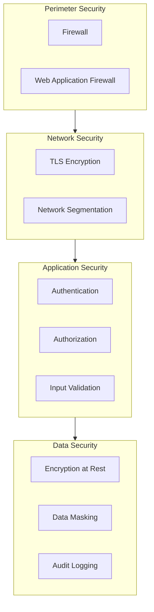
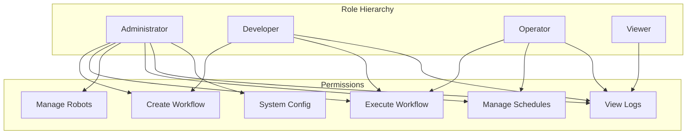
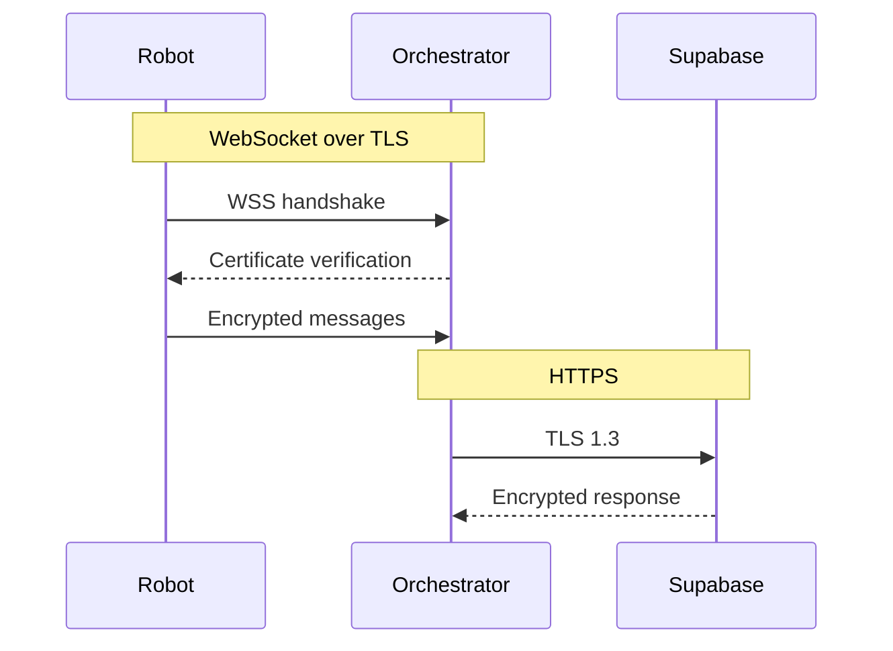
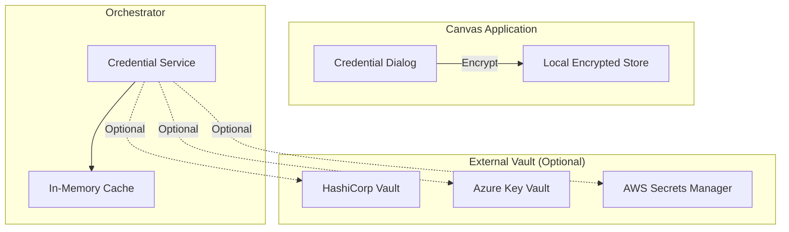
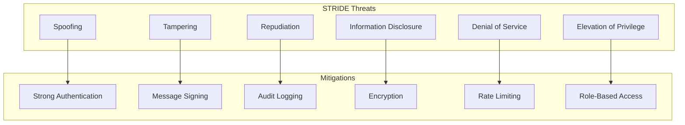
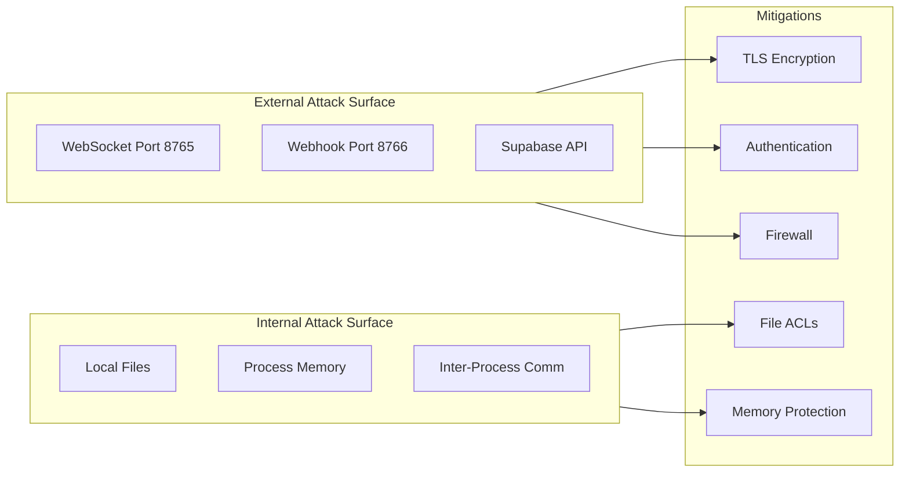
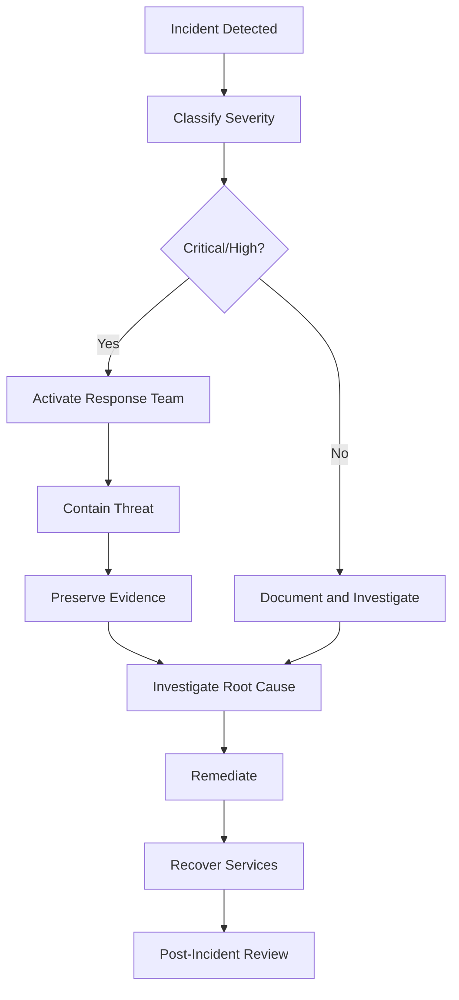

# CasareRPA Security Architecture

This document describes the security model, threat analysis, and mitigation strategies for the CasareRPA platform.

## Table of Contents

1. [Security Overview](#security-overview)
2. [Authentication and Authorization](#authentication-and-authorization)
3. [Communication Security](#communication-security)
4. [Data Protection](#data-protection)
5. [Credential Management](#credential-management)
6. [Threat Model](#threat-model)
7. [Security Controls](#security-controls)
8. [Compliance Considerations](#compliance-considerations)
9. [Security Best Practices](#security-best-practices)
10. [Incident Response](#incident-response)

---

## Security Overview

### Security Principles

CasareRPA follows defense-in-depth principles:



### Security Architecture Diagram

```mermaid
C4Context
    title Security Context Diagram

    Person(user, "RPA User", "Authenticated user")
    Person(admin, "Admin", "System administrator")

    System_Boundary(casare, "CasareRPA Platform") {
        System(canvas, "Canvas", "User authentication required")
        System(orchestrator, "Orchestrator", "Service authentication")
        System(robot, "Robot", "Machine authentication")
    }

    System_Ext(idp, "Identity Provider", "Optional SSO/LDAP")
    System_Ext(vault, "Secret Vault", "Credential storage")
    System_Ext(siem, "SIEM", "Security monitoring")

    BiRel(user, canvas, "MFA")
    BiRel(admin, orchestrator, "MFA + Role")
    Rel(robot, orchestrator, "API Key/Certificate")
    Rel(casare, vault, "Secure credential fetch")
    Rel(casare, siem, "Audit events")
```

---

## Authentication and Authorization

### Authentication Methods

| Component | Method | Description |
|-----------|--------|-------------|
| Canvas | Session-based | User login with optional MFA |
| Orchestrator API | JWT + API Key | Token-based authentication |
| Robot Agent | API Key | Machine-to-machine auth |
| Webhooks | HMAC Signature | Request signing |

### Token Management

```python
# Token generation (from resilience.py)
from casare_rpa.infrastructure.orchestrator.resilience import SecurityManager

security = SecurityManager(
    secret_key="secure-random-key",
    token_ttl_hours=24,
    rate_limit_requests=100,
    rate_limit_window=60
)

# Generate robot token
token = security.generate_token(
    robot_id="robot-uuid",
    scopes=["execute", "report"]
)

# Validate token
validated = security.validate_token(token.token)
if validated and not validated.is_expired:
    # Token is valid
    pass
```

### Token Structure

```json
{
  "token": "base64-encoded-secure-random",
  "token_type": "api_key",
  "robot_id": "robot-uuid",
  "expires_at": "2024-01-16T10:30:00Z",
  "scopes": ["execute", "report"]
}
```

### Authorization Model



### Permission Matrix

| Action | Admin | Developer | Operator | Viewer |
|--------|-------|-----------|----------|--------|
| Create Workflow | Yes | Yes | No | No |
| Edit Workflow | Yes | Yes | No | No |
| Delete Workflow | Yes | No | No | No |
| Execute Workflow | Yes | Yes | Yes | No |
| View Execution Logs | Yes | Yes | Yes | Yes |
| Manage Robots | Yes | No | No | No |
| Create Schedules | Yes | Yes | Yes | No |
| System Configuration | Yes | No | No | No |
| Manage Users | Yes | No | No | No |
| Manage Credentials | Yes | Yes | No | No |

---

## Communication Security

### Transport Layer Security

All network communication uses TLS 1.3:



### WebSocket Security

```python
# Secure WebSocket configuration
import ssl
import websockets

ssl_context = ssl.SSLContext(ssl.PROTOCOL_TLS_SERVER)
ssl_context.load_cert_chain(
    certfile="server.crt",
    keyfile="server.key"
)
ssl_context.minimum_version = ssl.TLSVersion.TLSv1_3

async with websockets.serve(
    handler,
    host="0.0.0.0",
    port=8765,
    ssl=ssl_context
):
    await asyncio.Future()  # Run forever
```

### Message Signing

```python
# HMAC message signing (from resilience.py)
import hmac
import hashlib

class SecurityManager:
    def sign_message(self, message: str) -> str:
        """Sign a message with HMAC-SHA256."""
        signature = hmac.new(
            self._secret_key.encode(),
            message.encode(),
            hashlib.sha256
        ).hexdigest()
        return signature

    def verify_signature(self, message: str, signature: str) -> bool:
        """Verify message signature using constant-time comparison."""
        expected = self.sign_message(message)
        return hmac.compare_digest(expected, signature)
```

### Rate Limiting

```python
# Rate limiting implementation (from resilience.py)
class SecurityManager:
    def check_rate_limit(self, identifier: str) -> bool:
        """
        Check if request is within rate limits.

        Args:
            identifier: Client identifier (robot_id, IP, etc.)

        Returns:
            True if within limits, False if exceeded
        """
        now = time.time()
        window_start = now - self._rate_limit_window

        # Clean old entries
        self._request_counts[identifier] = [
            ts for ts in self._request_counts[identifier]
            if ts > window_start
        ]

        # Check limit
        if len(self._request_counts[identifier]) >= self._rate_limit_requests:
            return False

        # Record request
        self._request_counts[identifier].append(now)
        return True
```

---

## Data Protection

### Data Classification

| Classification | Description | Examples | Protection |
|----------------|-------------|----------|------------|
| Public | Non-sensitive | Documentation | None required |
| Internal | Business data | Workflow names | Access control |
| Confidential | Sensitive | Credentials | Encryption |
| Restricted | Highly sensitive | PII, financial | Encryption + audit |

### Encryption at Rest

```python
from cryptography.fernet import Fernet
from cryptography.hazmat.primitives import hashes
from cryptography.hazmat.primitives.kdf.pbkdf2 import PBKDF2HMAC
import base64
import os

def derive_key(password: str, salt: bytes) -> bytes:
    """Derive encryption key from password."""
    kdf = PBKDF2HMAC(
        algorithm=hashes.SHA256(),
        length=32,
        salt=salt,
        iterations=480000,
    )
    return base64.urlsafe_b64encode(kdf.derive(password.encode()))

def encrypt_sensitive_data(data: str, key: bytes) -> bytes:
    """Encrypt sensitive data."""
    f = Fernet(key)
    return f.encrypt(data.encode())

def decrypt_sensitive_data(encrypted: bytes, key: bytes) -> str:
    """Decrypt sensitive data."""
    f = Fernet(key)
    return f.decrypt(encrypted).decode()
```

### Data Masking

```python
def mask_sensitive_value(value: str, visible_chars: int = 4) -> str:
    """
    Mask sensitive values for logging/display.

    Args:
        value: The value to mask
        visible_chars: Number of characters to show at end

    Returns:
        Masked value (e.g., "****1234")
    """
    if len(value) <= visible_chars:
        return "*" * len(value)
    masked_len = len(value) - visible_chars
    return "*" * masked_len + value[-visible_chars:]

# Usage in logging
logger.info(f"Using API key: {mask_sensitive_value(api_key)}")
# Output: "Using API key: ****abc123"
```

### Audit Logging

```python
from loguru import logger
from datetime import datetime
import json

class AuditLogger:
    """Security audit logger."""

    def __init__(self, log_path: str):
        self._logger = logger.bind(type="audit")
        self._logger.add(
            log_path,
            format="{time:YYYY-MM-DD HH:mm:ss} | {level} | {message}",
            rotation="1 day",
            retention="90 days",
            compression="gz"
        )

    def log_event(
        self,
        event_type: str,
        actor: str,
        resource: str,
        action: str,
        outcome: str,
        details: dict = None
    ):
        """Log a security-relevant event."""
        event = {
            "timestamp": datetime.utcnow().isoformat(),
            "event_type": event_type,
            "actor": actor,
            "resource": resource,
            "action": action,
            "outcome": outcome,
            "details": details or {}
        }
        self._logger.info(json.dumps(event))

# Usage
audit = AuditLogger("logs/audit/security.log")
audit.log_event(
    event_type="authentication",
    actor="user@example.com",
    resource="orchestrator",
    action="login",
    outcome="success",
    details={"ip": "192.168.1.100", "method": "password"}
)
```

---

## Credential Management

### Credential Storage Architecture



### Secure Credential Handling

```python
from dataclasses import dataclass
from typing import Optional
import keyring
import json
from cryptography.fernet import Fernet

@dataclass
class Credential:
    """Secure credential container."""
    name: str
    username: str
    _password_encrypted: bytes
    _key: bytes

    @property
    def password(self) -> str:
        """Decrypt and return password."""
        f = Fernet(self._key)
        return f.decrypt(self._password_encrypted).decode()

    def __repr__(self) -> str:
        """Hide password in repr."""
        return f"Credential(name='{self.name}', username='{self.username}', password='****')"

class CredentialManager:
    """Secure credential management."""

    def __init__(self, service_name: str = "CasareRPA"):
        self._service = service_name
        self._key = self._get_or_create_key()

    def _get_or_create_key(self) -> bytes:
        """Get or create encryption key from OS keyring."""
        key = keyring.get_password(self._service, "master_key")
        if not key:
            key = Fernet.generate_key().decode()
            keyring.set_password(self._service, "master_key", key)
        return key.encode()

    def store_credential(
        self,
        name: str,
        username: str,
        password: str
    ) -> None:
        """Store a credential securely."""
        f = Fernet(self._key)
        encrypted = f.encrypt(password.encode())

        # Store in OS keyring
        keyring.set_password(
            self._service,
            name,
            json.dumps({
                "username": username,
                "password": encrypted.decode()
            })
        )

    def get_credential(self, name: str) -> Optional[Credential]:
        """Retrieve a credential."""
        data = keyring.get_password(self._service, name)
        if not data:
            return None

        parsed = json.loads(data)
        return Credential(
            name=name,
            username=parsed["username"],
            _password_encrypted=parsed["password"].encode(),
            _key=self._key
        )

    def delete_credential(self, name: str) -> bool:
        """Delete a credential."""
        try:
            keyring.delete_password(self._service, name)
            return True
        except keyring.errors.PasswordDeleteError:
            return False
```

### Credential Usage in Workflows

```json
{
  "nodes": [
    {
      "id": "login",
      "type": "browser.type",
      "properties": {
        "selector": "#password",
        "value": "${credential:login_cred.password}"
      }
    }
  ],
  "variables": {
    "login_cred": {
      "type": "credential",
      "ref": "production_login"
    }
  }
}
```

---

## Threat Model

### STRIDE Analysis



### Threat Scenarios

| Threat | Asset | Attack Vector | Impact | Mitigation |
|--------|-------|---------------|--------|------------|
| Robot impersonation | Orchestrator | Stolen API key | Unauthorized execution | Key rotation, IP allowlist |
| Workflow tampering | Workflows | Insider threat | Malicious automation | Code signing, version control |
| Credential theft | Credentials | Memory dump | Account compromise | In-memory encryption, HSM |
| DoS attack | Orchestrator | Request flood | Service unavailable | Rate limiting, WAF |
| Data exfiltration | Execution logs | Compromised robot | Data breach | Log encryption, DLP |
| Privilege escalation | RBAC | Session hijacking | Unauthorized access | Session management, MFA |

### Attack Surface



---

## Security Controls

### Input Validation

```python
from pydantic import BaseModel, validator, constr
from typing import Optional
import re

class WorkflowInput(BaseModel):
    """Validated workflow input."""

    workflow_id: constr(min_length=1, max_length=100, regex=r'^[a-zA-Z0-9_-]+$')
    workflow_name: constr(min_length=1, max_length=200)
    priority: int

    @validator('priority')
    def validate_priority(cls, v):
        if v < 0 or v > 3:
            raise ValueError('Priority must be between 0 and 3')
        return v

class SelectorInput(BaseModel):
    """Validated CSS selector input."""

    selector: str

    @validator('selector')
    def validate_selector(cls, v):
        # Block potentially dangerous selectors
        dangerous_patterns = [
            r'javascript:',
            r'data:',
            r'<script',
            r'onclick',
            r'onerror'
        ]
        for pattern in dangerous_patterns:
            if re.search(pattern, v, re.IGNORECASE):
                raise ValueError(f'Potentially dangerous selector pattern: {pattern}')
        return v
```

### Output Encoding

```python
import html

def safe_log_output(value: str) -> str:
    """
    Safely encode output for logging.
    Prevents log injection attacks.
    """
    # Encode HTML entities
    encoded = html.escape(value)
    # Remove control characters
    encoded = ''.join(
        char for char in encoded
        if ord(char) >= 32 or char in '\n\r\t'
    )
    # Truncate if too long
    if len(encoded) > 10000:
        encoded = encoded[:10000] + "...[truncated]"
    return encoded
```

### Security Headers

For webhook endpoints:

```python
from fastapi import FastAPI, Response
from fastapi.middleware.cors import CORSMiddleware

app = FastAPI()

@app.middleware("http")
async def add_security_headers(request, call_next):
    response = await call_next(request)
    response.headers["X-Content-Type-Options"] = "nosniff"
    response.headers["X-Frame-Options"] = "DENY"
    response.headers["X-XSS-Protection"] = "1; mode=block"
    response.headers["Strict-Transport-Security"] = "max-age=31536000; includeSubDomains"
    response.headers["Content-Security-Policy"] = "default-src 'self'"
    return response

# CORS configuration
app.add_middleware(
    CORSMiddleware,
    allow_origins=["https://trusted-domain.com"],
    allow_credentials=True,
    allow_methods=["POST"],
    allow_headers=["Authorization", "Content-Type"],
)
```

---

## Compliance Considerations

### Data Privacy (GDPR/CCPA)

| Requirement | Implementation |
|-------------|---------------|
| Data minimization | Only collect necessary data |
| Purpose limitation | Clear workflow data usage |
| Storage limitation | Automatic log rotation |
| Right to erasure | Credential/log deletion APIs |
| Data portability | Export workflows as JSON |
| Consent | User acknowledgment on login |

### Audit Requirements (SOC 2)

| Control | Evidence |
|---------|----------|
| Access control | Role-based permissions |
| Authentication | MFA support, token management |
| Audit logging | Security event logs |
| Change management | Version control integration |
| Incident response | Documented procedures |

### PCI-DSS Considerations

If processing payment data:

- [ ] Encrypt cardholder data in transit and at rest
- [ ] Implement strong access control
- [ ] Maintain vulnerability management program
- [ ] Regularly test security systems
- [ ] Maintain information security policy

---

## Security Best Practices

### Development

1. **Never commit secrets** - Use environment variables or vaults
2. **Validate all input** - Use Pydantic models
3. **Use parameterized queries** - Prevent SQL injection
4. **Log security events** - Enable audit logging
5. **Keep dependencies updated** - Regular security patches

### Deployment

1. **Use TLS everywhere** - No plain HTTP
2. **Implement firewall rules** - Restrict ports
3. **Enable rate limiting** - Prevent abuse
4. **Use service accounts** - Minimal permissions
5. **Rotate credentials** - Regular rotation schedule

### Operations

1. **Monitor security logs** - SIEM integration
2. **Regular security scans** - Vulnerability assessment
3. **Incident response plan** - Documented procedures
4. **Security training** - Team awareness
5. **Backup encryption keys** - Secure key escrow

### Robot Security

```yaml
# Secure robot configuration
robot:
  # Restrict capabilities
  allowed_domains:
    - "*.internal.company.com"
    - "trusted-vendor.com"

  blocked_actions:
    - "file_delete"
    - "registry_modify"
    - "execute_shell"

  # Resource limits
  max_memory_mb: 2048
  max_cpu_percent: 80
  max_browser_tabs: 5

  # Network restrictions
  proxy:
    enabled: true
    url: "http://proxy.internal:8080"
    bypass: ["localhost", "127.0.0.1"]
```

---

## Incident Response

### Incident Classification

| Severity | Description | Response Time | Examples |
|----------|-------------|---------------|----------|
| Critical | Active breach | 15 minutes | Data exfiltration |
| High | Vulnerability exploited | 1 hour | Unauthorized access |
| Medium | Potential threat | 4 hours | Suspicious activity |
| Low | Minor issue | 24 hours | Policy violation |

### Response Procedure



### Containment Actions

| Action | Command/Procedure |
|--------|-------------------|
| Revoke robot tokens | `security.revoke_robot_tokens(robot_id)` |
| Disable robot | Set status to "maintenance" |
| Block IP | Add to firewall blocklist |
| Pause all jobs | `engine.pause_job_submissions()` |
| Kill active jobs | `engine.cancel_all_jobs()` |
| Rotate secrets | Regenerate and redeploy |

### Evidence Collection

```python
async def collect_security_evidence(incident_id: str):
    """Collect evidence for security incident."""
    evidence_path = f"evidence/{incident_id}"
    os.makedirs(evidence_path, exist_ok=True)

    # Collect logs
    shutil.copy("logs/orchestrator.log", f"{evidence_path}/")
    shutil.copy("logs/audit/security.log", f"{evidence_path}/")

    # Collect connection state
    with open(f"{evidence_path}/connections.json", "w") as f:
        json.dump(engine.get_connection_state(), f, indent=2)

    # Collect job history
    jobs = engine.get_recent_jobs(hours=24)
    with open(f"{evidence_path}/jobs.json", "w") as f:
        json.dump([j.to_dict() for j in jobs], f, indent=2)

    # Create hash manifest
    create_evidence_hashes(evidence_path)

    logger.info(f"Evidence collected to {evidence_path}")
```

---

## Security Checklist

### Pre-Deployment

- [ ] TLS certificates configured
- [ ] Secrets stored in vault/environment
- [ ] Firewall rules applied
- [ ] Rate limiting enabled
- [ ] Audit logging configured
- [ ] Credential encryption verified
- [ ] Input validation tested
- [ ] Security scan completed

### Post-Deployment

- [ ] Monitor security logs
- [ ] Test authentication flows
- [ ] Verify encryption in transit
- [ ] Check credential access
- [ ] Review robot permissions
- [ ] Validate backup encryption

---

## Related Documentation

- [System Overview](../architecture/SYSTEM_OVERVIEW.md)
- [API Reference](../api/REST_API_REFERENCE.md)
- [Operations Runbook](../operations/RUNBOOK.md)
- [Troubleshooting Guide](../operations/TROUBLESHOOTING.md)
