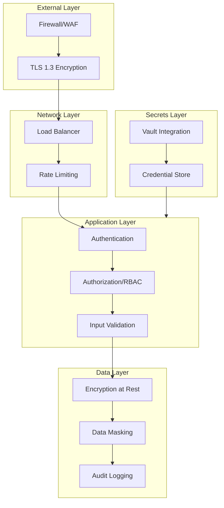
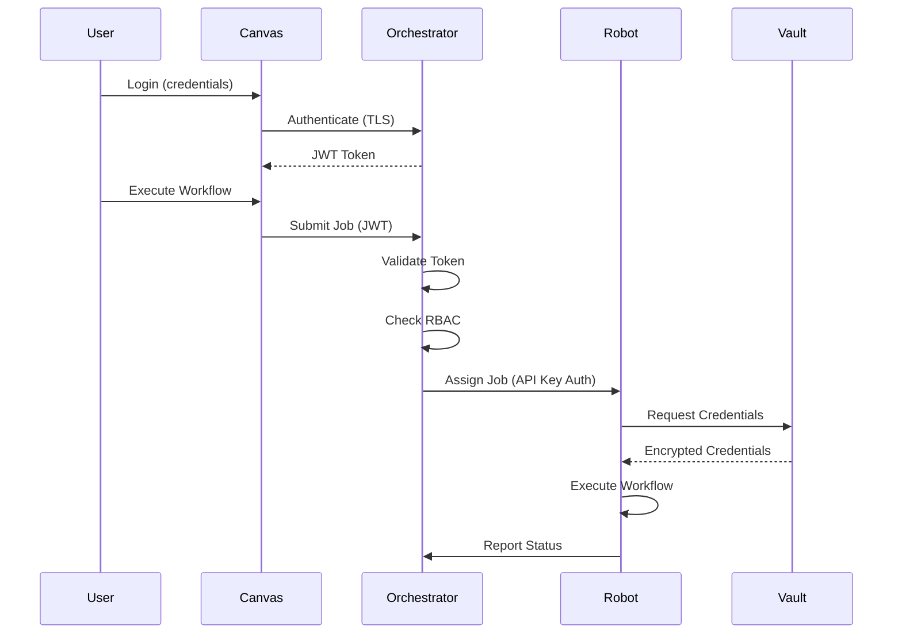

# Security Architecture

CasareRPA implements a defense-in-depth security model with multiple layers of protection to safeguard automation workflows, credentials, and sensitive data.

## Overview

The security architecture is designed around three core principles:

1. **Zero Trust**: Every request is authenticated and authorized, regardless of origin
2. **Least Privilege**: Components and users receive only the minimum permissions required
3. **Defense in Depth**: Multiple security layers provide redundant protection

## Security Layers



## Defense in Depth Approach

### Layer 1: Network Security

| Control | Description |
|---------|-------------|
| TLS 1.3 | All communications encrypted in transit |
| Rate Limiting | Prevents brute-force and DoS attacks |
| IP Allowlisting | Restrict Orchestrator API access to known IPs |
| VPN Support | Optional VPN requirement for Robot connections |

### Layer 2: Authentication

CasareRPA supports multiple authentication methods:

- **JWT Tokens**: Stateless authentication for Canvas and API access
- **Robot API Keys**: Long-lived keys for Robot-to-Orchestrator communication
- **OAuth 2.0**: Integration with Google Workspace and third-party services
- **Session Management**: Secure session handling with idle timeout

```python
from casare_rpa.infrastructure.auth import TokenManager, SessionManager

# JWT token flow
token_manager = TokenManager(config)
access_token = token_manager.create_access_token(user_id, roles)
claims = token_manager.verify_token(access_token)

# Session management
session_manager = SessionManager(session_config)
session = await session_manager.create_session(user_id, token, client_info)
```

### Layer 3: Authorization (RBAC)

Role-Based Access Control governs all operations:

```python
from casare_rpa.infrastructure.security.rbac import RBACManager, Permission, Role

rbac = RBACManager()

# Check permissions
if rbac.has_permission(user, Permission.WORKFLOW_EXECUTE):
    await execute_workflow(workflow_id)
```

**Built-in Roles:**

| Role | Description | Key Permissions |
|------|-------------|-----------------|
| `admin` | Full system access | All permissions |
| `developer` | Create and edit workflows | workflow.*, credential.read |
| `operator` | Execute workflows | workflow.execute, robot.view |
| `viewer` | Read-only access | *.view |
| `robot` | Robot agent access | execution.*, heartbeat |

**Permission Categories:**

- `workflow.*` - Create, read, update, delete, execute workflows
- `robot.*` - Register, manage, view robot agents
- `credential.*` - Manage credential store entries
- `user.*` - User and role management
- `audit.*` - View and export audit logs
- `system.*` - System configuration

### Layer 4: Data Encryption

**At Rest:**

- Credential store: AES-256-GCM encryption
- Workflow files: Optional encryption for sensitive workflows
- Database: Transparent Data Encryption (TDE) support

**In Transit:**

- TLS 1.3 for all API communications
- Encrypted WebSocket connections for real-time updates
- Robot heartbeat encryption

```python
from casare_rpa.infrastructure.security.credential_store import CredentialStore

store = CredentialStore(encryption_key=master_key)
store.save_credential(
    name="api_cred",
    credential_type=CredentialType.API_KEY_KIND,
    data={"api_key": "secret_value"}
)
# Data is automatically encrypted before storage
```

### Layer 5: Credential Storage

CasareRPA provides multiple credential storage options:

| Provider | Use Case | Features |
|----------|----------|----------|
| Built-in Store | Development, small deployments | AES-256 encryption, local storage |
| HashiCorp Vault | Enterprise, high-security | Dynamic secrets, audit, rotation |
| Azure Key Vault | Azure deployments | Managed HSM, Azure AD integration |
| AWS Secrets Manager | AWS deployments | IAM integration, cross-region replication |

See [credentials.md](./credentials.md) for detailed configuration.

### Layer 6: Input Validation

All user input is validated and sanitized:

```python
from casare_rpa.infrastructure.security.validators import (
    validate_selector,
    validate_url,
    sanitize_script
)

# Selector validation (prevent injection)
validated_selector = validate_selector(user_input)

# URL validation (prevent SSRF)
validated_url = validate_url(target_url, allowed_schemes=['https'])

# Script sanitization (for Python/JS nodes)
safe_script = sanitize_script(user_script)
```

**Validation Rules:**

- CSS/XPath selectors: Whitelist allowed characters
- URLs: Validate scheme, host, and prevent internal network access
- File paths: Prevent directory traversal
- JSON payloads: Schema validation
- SQL queries: Parameterized queries only

### Layer 7: Audit Logging

All security-relevant events are logged with tamper-proof hashing:

```python
from casare_rpa.infrastructure.security.merkle_audit import (
    log_audit_event,
    AuditAction,
    ResourceType
)

await log_audit_event(
    action=AuditAction.CREDENTIAL_ACCESS,
    actor_id=user_id,
    resource_type=ResourceType.CREDENTIAL,
    resource_id=credential_id,
    details={"accessed_for": "workflow_execution"},
    ip_address=request.client.host
)
```

**Audited Events:**

- Authentication: login, logout, failed attempts, token refresh
- Workflows: create, update, delete, execute, publish
- Credentials: create, update, delete, access
- Robots: register, deregister, status changes
- Users: invite, remove, role changes
- System: configuration changes, audit exports

**Merkle Tree Verification:**

```python
from casare_rpa.infrastructure.security.merkle_audit import get_audit_service

service = get_audit_service()

# Verify audit log integrity
result = await service.verify_chain()
if not result.is_valid:
    alert_security_team(result.error_message)

# Export with Merkle proof for compliance
export = await service.export_audit_log(
    start_date=datetime(2025, 1, 1),
    include_proof=True
)
```

## Data Flow Security



## Security Configuration

### Minimum Security Settings

```yaml
# config/security.yaml
security:
  # Encryption
  encryption:
    algorithm: AES-256-GCM
    key_derivation: PBKDF2-SHA256
    iterations: 100000

  # Authentication
  auth:
    jwt_algorithm: RS256
    access_token_ttl: 3600  # 1 hour
    refresh_token_ttl: 604800  # 7 days

  # Session
  session:
    timeout_minutes: 480  # 8 hours
    idle_timeout_minutes: 30
    max_sessions_per_user: 3

  # Rate limiting
  rate_limit:
    login_attempts: 5
    login_window_seconds: 300
    api_requests_per_minute: 100

  # RBAC
  rbac:
    default_role: viewer
    enforce_mfa_for_admin: true
```

### Production Recommendations

1. **Enable MFA** for all admin and developer accounts
2. **Use external vault** (HashiCorp Vault, Azure Key Vault, or AWS Secrets Manager)
3. **Configure IP allowlisting** for Orchestrator API
4. **Enable audit log export** to SIEM
5. **Rotate credentials** every 90 days minimum
6. **Review RBAC permissions** quarterly

## Compliance

CasareRPA's security architecture supports compliance with:

| Standard | Relevant Controls |
|----------|-------------------|
| SOC 2 Type II | Audit logging, access controls, encryption |
| GDPR | Data masking, audit trail, access logs |
| HIPAA | Encryption, audit trail, access controls |
| PCI DSS | Credential storage, network segmentation |

## Security Incident Response

In case of a security incident:

1. **Isolate**: Disable affected Robot agents and API keys
2. **Investigate**: Review audit logs for the affected timeframe
3. **Remediate**: Rotate compromised credentials, patch vulnerabilities
4. **Report**: Document incident and notify affected parties

```python
# Emergency credential rotation
from casare_rpa.infrastructure.security.vault_client import VaultClient

async with VaultClient(config) as vault:
    # Rotate all credentials accessed by compromised robot
    compromised_credentials = await get_robot_credentials(robot_id)
    for cred_path in compromised_credentials:
        await vault.rotate_secret(cred_path)
```

## Related Documentation

- [Authentication Methods](./authentication.md)
- [Credential Management](./credentials.md)
- [Security Best Practices](./best-practices.md)
