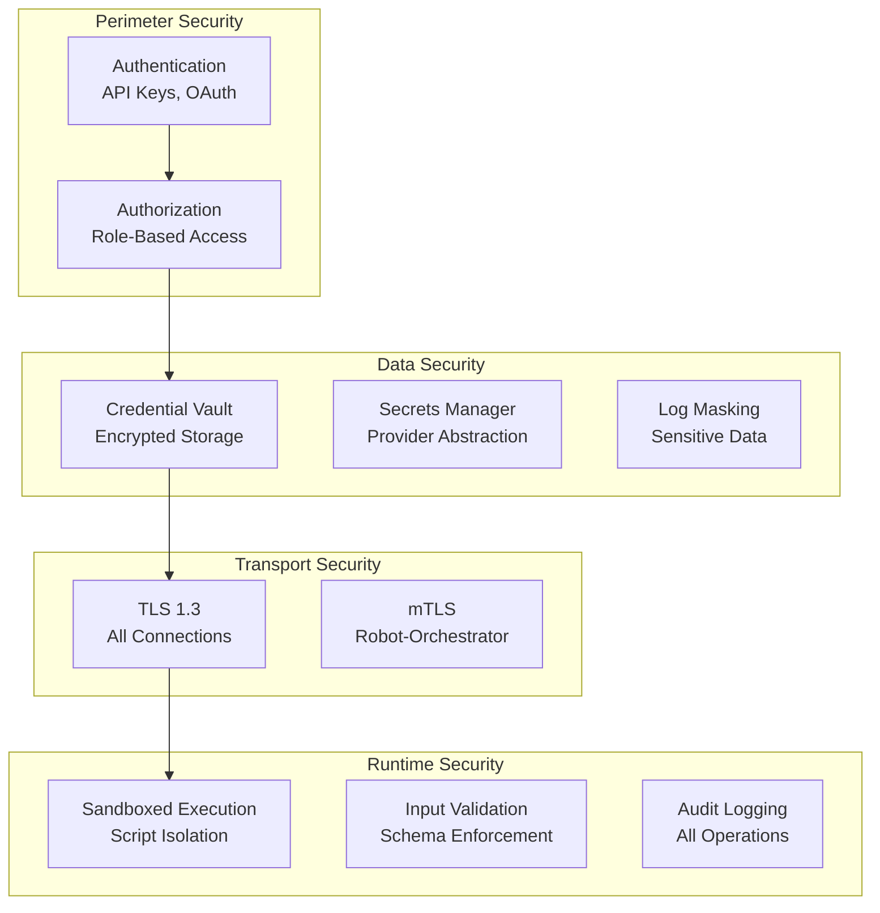

# Security Documentation

Security is a foundational aspect of CasareRPA. This documentation covers the security architecture, authentication mechanisms, credential management, and best practices for secure automation.

---

## Security Overview

CasareRPA implements defense-in-depth security with multiple layers of protection:



### Security Features Summary

| Feature | Description | Status |
|---------|-------------|--------|
| **API Key Authentication** | Robot and API access control | Active |
| **OAuth 2.0 / OIDC** | Enterprise identity integration | Active |
| **Role-Based Access Control** | Fine-grained permissions | Active |
| **Credential Vault** | Encrypted credential storage | Active |
| **External Secrets** | HashiCorp Vault, AWS, Azure integration | Active |
| **mTLS** | Robot-Orchestrator mutual authentication | Active |
| **Audit Logging** | Complete operation history | Active |
| **Log Masking** | Automatic sensitive data redaction | Active |
| **Input Validation** | Schema-based validation | Active |
| **Sandboxed Scripts** | Safe Python/JavaScript execution | Active |

---

## Security Sections

### [Security Architecture](architecture.md)

Defense layers and threat model documentation.

| Topic | Description |
|-------|-------------|
| [Threat Model](architecture.md#threat-model) | Identified threats and mitigations |
| [Defense Layers](architecture.md#defense-layers) | Security control hierarchy |
| [Trust Boundaries](architecture.md#trust-boundaries) | Component trust relationships |
| [Data Classification](architecture.md#data-classification) | Sensitive data handling |

### [Authentication](authentication.md)

Identity and access management.

| Topic | Description |
|-------|-------------|
| [API Keys](authentication.md#api-keys) | Robot and service authentication |
| [OAuth 2.0](authentication.md#oauth) | Enterprise SSO integration |
| [Robot Authentication](authentication.md#robot-auth) | Agent-to-orchestrator auth |
| [Session Management](authentication.md#sessions) | Token lifecycle |

### [Credentials Management](credentials.md)

Secure storage and usage of secrets.

| Topic | Description |
|-------|-------------|
| [Credential Vault](credentials.md#vault) | Built-in encrypted storage |
| [External Providers](credentials.md#providers) | HashiCorp Vault, AWS, Azure |
| [Credential Binding](credentials.md#binding) | Linking credentials to workflows |
| [Rotation](credentials.md#rotation) | Credential lifecycle management |

### [Best Practices](best-practices.md)

Security guidelines for workflow development and operations.

| Topic | Description |
|-------|-------------|
| [Workflow Security](best-practices.md#workflows) | Secure workflow design |
| [Credential Handling](best-practices.md#credentials) | Never hardcode secrets |
| [Network Security](best-practices.md#network) | Firewall and proxy configuration |
| [Deployment Security](best-practices.md#deployment) | Production hardening |

---

## Authentication

CasareRPA supports multiple authentication methods:

### API Key Authentication

```python
# Generate API key for robot
from casare_rpa.infrastructure.auth import RobotApiKeyService

service = RobotApiKeyService()
api_key = await service.create_key(
    robot_id="robot-001",
    name="Production Robot",
    scopes=["workflow:execute", "job:read"]
)
```

```bash
# Use API key in requests
curl -X GET http://localhost:8000/api/v1/jobs \
  -H "Authorization: Bearer cas_xxxxxxxxxxxx"
```

### OAuth 2.0 Integration

```yaml
# config/auth.yaml
oauth:
  provider: azure-ad  # or okta, auth0, keycloak
  client_id: ${OAUTH_CLIENT_ID}
  client_secret: ${OAUTH_CLIENT_SECRET}
  tenant_id: ${AZURE_TENANT_ID}
  scopes:
    - openid
    - profile
    - email
```

### Role-Based Access Control

| Role | Permissions |
|------|-------------|
| `admin` | Full system access |
| `operator` | Execute workflows, view logs |
| `designer` | Create/edit workflows |
| `viewer` | Read-only access |

```python
from casare_rpa.infrastructure.security import AuthorizationService

auth = AuthorizationService()

# Check permission
if await auth.has_permission(user_id, "workflow:execute"):
    await execute_workflow()
```

---

## Credential Management

### Built-in Vault

CasareRPA includes an encrypted credential vault:

```python
from casare_rpa.infrastructure.security import VaultClient

vault = VaultClient()

# Store credential
await vault.store(
    key="api/service-x",
    value={"api_key": "secret123"},
    metadata={"owner": "user@example.com"}
)

# Retrieve credential
creds = await vault.get("api/service-x")
```

### External Providers

Integrate with enterprise secret managers:

```yaml
# config/secrets.yaml
provider: hashicorp-vault  # or aws-secrets, azure-keyvault

hashicorp_vault:
  address: https://vault.example.com
  auth_method: kubernetes  # or token, approle
  mount_path: secret/casare-rpa
```

```python
# Usage in nodes
from casare_rpa.domain import resolve_node_credential

# Automatically resolves from configured provider
api_key = await resolve_node_credential(context, "api_key")
```

### Credential Properties

Use credential-aware property definitions:

```python
from casare_rpa.domain import API_KEY_PROP, USERNAME_PROP, PASSWORD_PROP

@properties(
    API_KEY_PROP,  # Provides credential picker widget
    PropertyDef("endpoint", PropertyType.STRING),
)
class MyApiNode(BaseNode):
    pass
```

---

## Transport Security

### TLS Configuration

All network communication uses TLS 1.3:

```yaml
# config/tls.yaml
tls:
  min_version: "1.3"
  cert_file: /etc/casare/tls/server.crt
  key_file: /etc/casare/tls/server.key
  ca_file: /etc/casare/tls/ca.crt
```

### Robot-Orchestrator mTLS

Mutual TLS for robot authentication:

```python
from casare_rpa.infrastructure.tunnel import MTLSConfig

mtls = MTLSConfig(
    cert_path="/etc/casare/robot.crt",
    key_path="/etc/casare/robot.key",
    ca_path="/etc/casare/ca.crt",
)
```

---

## Audit Logging

All security-relevant operations are logged:

```python
# Automatic audit logging
{
    "timestamp": "2024-01-15T10:30:00Z",
    "event_type": "workflow.executed",
    "user_id": "user@example.com",
    "robot_id": "robot-001",
    "workflow_id": "wf-123",
    "result": "success",
    "ip_address": "192.168.1.100",
    "user_agent": "CasareRPA-Robot/1.0"
}
```

### Audit Events

| Event | Description |
|-------|-------------|
| `auth.login` | User authentication |
| `auth.logout` | User session end |
| `auth.api_key_created` | API key generation |
| `workflow.created` | Workflow creation |
| `workflow.executed` | Workflow execution |
| `credential.accessed` | Credential retrieval |
| `robot.registered` | Robot registration |
| `job.submitted` | Job submission |

---

## Input Validation

All inputs are validated against schemas:

```python
from casare_rpa.domain.schemas import PropertyDef, PropertyType

@properties(
    PropertyDef(
        "url",
        PropertyType.STRING,
        pattern=r"^https?://",  # URL pattern validation
        required=True,
    ),
    PropertyDef(
        "timeout",
        PropertyType.INTEGER,
        min_value=1000,
        max_value=300000,
    ),
)
class NavigateNode(BaseNode):
    pass
```

### Validation Features

- Schema-based property validation
- URL pattern enforcement
- SQL injection prevention
- Path traversal protection
- Script sandboxing

---

## Log Masking

Sensitive data is automatically masked in logs:

```python
# Configuration
LOG_MASK_PATTERNS = [
    r"password[=:]\s*\S+",
    r"api[_-]?key[=:]\s*\S+",
    r"bearer\s+\S+",
    r"authorization:\s*\S+",
]

# Result
# Before: "Using api_key=secret123"
# After:  "Using api_key=***MASKED***"
```

---

## Security Checklist

### Development

- [ ] Never hardcode credentials in workflows
- [ ] Use credential references, not literal values
- [ ] Validate all external inputs
- [ ] Use HTTPS for all external APIs
- [ ] Review script nodes for security issues

### Deployment

- [ ] Enable TLS for all endpoints
- [ ] Configure firewall rules
- [ ] Enable audit logging
- [ ] Set up credential rotation
- [ ] Configure RBAC permissions
- [ ] Enable mTLS for robots
- [ ] Review network segmentation

### Operations

- [ ] Monitor audit logs
- [ ] Review access patterns
- [ ] Rotate API keys regularly
- [ ] Update dependencies
- [ ] Perform security scans

---

## Compliance

CasareRPA supports compliance with:

| Standard | Features |
|----------|----------|
| **SOC 2** | Audit logging, access control, encryption |
| **GDPR** | Data masking, audit trails, deletion |
| **HIPAA** | Encryption, access control, logging |
| **PCI DSS** | Credential security, network isolation |

---

## Related Documentation

- [Developer Guide - Authentication](../developer-guide/api-reference/authentication.md)
- [Operations - Troubleshooting](../operations/troubleshooting.md)
- [Reference - Error Codes](../reference/error-codes/index.md)
