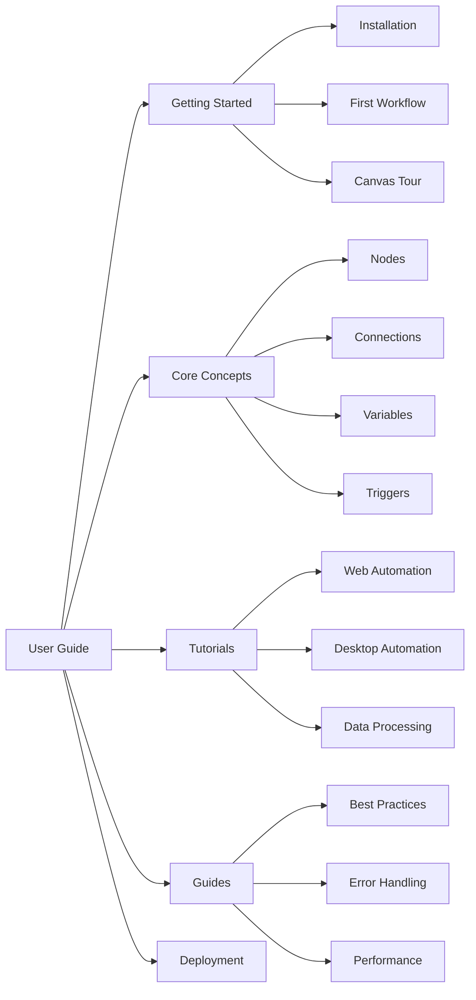

# User Guide

Welcome to the CasareRPA User Guide. This guide is designed for workflow designers and automation operators who want to build, run, and manage RPA workflows.

---

## Who Is This For?

- **Workflow Designers** - Build automation workflows using the visual canvas
- **Automation Operators** - Run and monitor workflows in production
- **Business Analysts** - Understand automation capabilities and design solutions
- **Process Owners** - Manage and maintain automation portfolios

---

## Guide Sections

### [Getting Started](getting-started/index.md)

Begin your automation journey with CasareRPA.

| Topic | Description |
|-------|-------------|
| [Installation](getting-started/installation.md) | Install Python, dependencies, and CasareRPA |
| [First Workflow](getting-started/first-workflow.md) | Build and run your first automation |
| [Canvas Tour](getting-started/canvas-tour.md) | Navigate the visual designer interface |
| [Quick Reference](getting-started/quick-reference.md) | Keyboard shortcuts and common actions |

### [Core Concepts](core-concepts/index.md)

Understand the fundamental building blocks of CasareRPA workflows.

| Concept | Description |
|---------|-------------|
| [Nodes](core-concepts/nodes.md) | Atomic automation operations |
| [Connections](core-concepts/connections.md) | Data and execution flow between nodes |
| [Variables](core-concepts/variables.md) | Store and manipulate data during execution |
| [Triggers](core-concepts/triggers.md) | Start workflows from events |
| [Subflows](core-concepts/subflows.md) | Reusable workflow components |
| [Projects](core-concepts/projects.md) | Organize workflows, variables, and credentials |

### [Tutorials](tutorials/index.md)

Step-by-step tutorials for common automation scenarios.

| Tutorial | Description | Difficulty |
|----------|-------------|------------|
| [Web Form Automation](tutorials/web-form.md) | Fill and submit web forms | Beginner |
| [Web Scraping](tutorials/web-scraping.md) | Extract data from websites | Beginner |
| [Excel Processing](tutorials/excel-processing.md) | Read, transform, and write Excel files | Beginner |
| [Email Automation](tutorials/email-automation.md) | Send and process emails | Intermediate |
| [Desktop Application](tutorials/desktop-app.md) | Automate Windows applications | Intermediate |
| [API Integration](tutorials/api-integration.md) | Connect to REST APIs | Intermediate |
| [Multi-Step Workflow](tutorials/multi-step.md) | Complex workflows with error handling | Advanced |
| [Scheduled Reports](tutorials/scheduled-reports.md) | Automated report generation | Advanced |

### [Guides](guides/index.md)

In-depth guides for specific topics and best practices.

| Guide | Description |
|-------|-------------|
| [Best Practices](guides/best-practices.md) | Design patterns and recommendations |
| [Error Handling](guides/error-handling.md) | Try-catch, retry, and recovery strategies |
| [Performance Optimization](guides/performance.md) | Speed up workflow execution |
| [Debugging Workflows](guides/debugging.md) | Use breakpoints and logs effectively |
| [Variables and Expressions](guides/variables-expressions.md) | Advanced variable manipulation |
| [Browser Automation](guides/browser-automation.md) | Web automation techniques |
| [Desktop Automation](guides/desktop-automation.md) | Windows UI automation patterns |
| [Data Transformation](guides/data-transformation.md) | JSON, CSV, XML processing |

### [Deployment](deployment/index.md)

Deploy and operate CasareRPA in production environments.

| Topic | Description |
|-------|-------------|
| [Robot Agents](deployment/robot-agents.md) | Configure headless execution agents |
| [Orchestrator](deployment/orchestrator.md) | Multi-robot management |
| [Scheduling](deployment/scheduling.md) | Cron-based workflow triggers |
| [Monitoring](deployment/monitoring.md) | Logs, metrics, and alerts |
| [High Availability](deployment/high-availability.md) | Production resilience patterns |

---

## Quick Start Path

If you are new to CasareRPA, follow this recommended learning path:

1. **[Installation](getting-started/installation.md)** - Get CasareRPA running on your machine
2. **[First Workflow](getting-started/first-workflow.md)** - Build a simple automation
3. **[Canvas Tour](getting-started/canvas-tour.md)** - Learn the interface
4. **[Nodes](core-concepts/nodes.md)** - Understand automation building blocks
5. **[Variables](core-concepts/variables.md)** - Work with data
6. **[Web Form Tutorial](tutorials/web-form.md)** - Complete your first real automation

---

## Node Categories Quick Reference

CasareRPA includes 413+ automation nodes organized by category:

| Category | Use Cases | Example Nodes |
|----------|-----------|---------------|
| **Browser** | Web automation | LaunchBrowser, Click, Type, ExtractText |
| **Desktop** | Windows apps | FindElement, ClickElement, SendKeys |
| **Data** | Data processing | ParseJSON, ReadCSV, TransformData |
| **HTTP** | API calls | HttpRequest, RestAPI, GraphQL |
| **Email** | Email automation | SendEmail, ReadEmail, ProcessAttachment |
| **File** | File operations | ReadFile, WriteFile, CopyFile, ZipArchive |
| **Database** | SQL operations | DatabaseQuery, ExecuteSQL, BulkInsert |
| **Control Flow** | Logic | If, ForLoop, While, Switch, TryCatch |
| **System** | OS operations | RunProcess, Clipboard, Dialog |

See the [Node Reference](../reference/nodes/index.md) for complete documentation.

---

## Trigger Types Quick Reference

Start workflows automatically with 20+ trigger types:

| Trigger | Description |
|---------|-------------|
| **Schedule** | Cron-based time triggers |
| **Webhook** | HTTP endpoint triggers |
| **File Watch** | File system change detection |
| **Email** | New email arrival |
| **Telegram** | Telegram bot messages |
| **WhatsApp** | WhatsApp messages |
| **Google Sheets** | Spreadsheet changes |
| **Google Drive** | File upload/modification |
| **RSS Feed** | New feed items |
| **Workflow Call** | Invoke from other workflows |

See the [Trigger Reference](../reference/triggers/index.md) for complete documentation.

---

## Getting Help

- **Documentation**: Search this guide for specific topics
- **Examples**: Check `examples/` for sample workflows
- **Troubleshooting**: See [Operations Troubleshooting](../operations/troubleshooting.md)
- **Issues**: Report bugs on GitHub

---

## Next Steps

Ready to begin? Start with [Installation](getting-started/installation.md).
